# Orion Architecture Diagrams

**Last Updated:** 2026-01-15 (v2)
**Purpose:** Visual documentation of Orion system architecture

---

## 1. System Architecture Overview

High-level data flow between Tauri desktop app, Supabase backend, Claude agents, and external services.

```mermaid
flowchart TD
    subgraph UserDevice["User's Mac (Tauri Desktop App)"]
        UI["Next.js Frontend<br/>• Chat Panel<br/>• Canvas (json-render)<br/>• PARA Views"]
        Rust["Tauri Backend (Rust)<br/>• IPC Handlers<br/>• SQLite Access"]
        SQLite[("SQLite + sqlite-vec<br/>(Local Primary)<br/>contacts, tasks,<br/>inbox, embeddings")]

        UI <-->|"Tauri IPC"| Rust
        Rust <-->|"Read/Write"| SQLite
    end

    subgraph Backend["Supabase Backend"]
        Auth["Supabase Auth<br/>Google/Apple OAuth"]
        EdgeFn["Edge Functions<br/>• Claude Proxy<br/>• Usage Metering<br/>• Rate Limiting"]
        PG[("PostgreSQL + pgvector<br/>(Cloud Sync)<br/>learnings,<br/>embeddings")]
        Stripe["Stripe Webhooks<br/>USD + USDC"]

        Auth --> PG
        EdgeFn --> PG
        Stripe --> EdgeFn
    end

    subgraph AgentServer["Agent Server (Node.js localhost:3001)"]
        SDK["Claude Agent SDK<br/>• Prompt Caching<br/>• Extended Thinking"]
        BuiltIn["Built-in Tools<br/>• bash_20250124<br/>• text_editor_20250728"]
        Butler["🎩 Butler Agent<br/>(Orchestrator)"]
        Specialists["Specialist Agents<br/>📋 Triage | 📅 Scheduler<br/>📧 Communicator | 🔍 Navigator"]

        SDK --> Butler
        Butler --> Specialists
        BuiltIn --> Butler
    end

    subgraph External["External Services"]
        Anthropic["Anthropic API<br/>Claude Opus 4.5"]
        Composio["Composio MCP<br/>Gmail, Calendar, Slack"]
    end

    subgraph Observability["Observability (Dual System)"]
        Braintrust["Braintrust<br/>Session tracing<br/>Learning extraction"]
        Langfuse["Langfuse<br/>Prompt management<br/>A/B testing"]
    end

    UI -->|"Auth Request"| Auth
    Rust -->|"Background Sync"| PG
    UI -->|"Chat Message"| EdgeFn
    EdgeFn -->|"+ API Key"| Anthropic
    Anthropic -->|"Streaming Response"| EdgeFn
    EdgeFn -->|"Stream"| UI

    Specialists -->|"Tool Calls"| Composio
    EdgeFn -.->|"HTTP/SSE"| AgentServer

    Composio -->|"Gmail/Calendar/Slack"| Specialists

    AgentServer -.->|"Traces"| Braintrust
    AgentServer -.->|"Prompts"| Langfuse
```



### Data Flow Summary

| Flow | Description |
|------|-------------|
| **User → Chat** | Message goes through Supabase Edge Function → Claude API (proxied, no user API key needed) |
| **Agent → Tools** | Butler delegates to specialists who call Composio for Gmail/Calendar/Slack |
| **Local Storage** | SQLite + sqlite-vec handles PARA data (contacts, tasks, projects, inbox) + local embeddings |
| **Cloud Sync** | Background sync to PostgreSQL + pgvector for cross-device learnings |
| **Auth** | Supabase Auth handles Google/Apple OAuth (zero user config) |
| **Payments** | Stripe integration tracks usage, handles USD + USDC |
| **Observability** | Dual system: Braintrust (session traces) + Langfuse (prompt management, A/B testing) |

### Claude Agent SDK Features Used

| Feature | Purpose |
|---------|---------|
| **Prompt Caching** | 50-80% cost savings - cache system prompt (5min), PARA context (1hr), user prefs (1hr) |
| **Extended Thinking** | Complex scheduling conflicts, multi-step planning, budget reasoning |
| **Built-in Tools** | bash_20250124 (terminal), text_editor_20250728 (file ops) |
| **Structured Outputs** | Type-safe triage results, task extraction, contact schemas |
| **canUseTool Callback** | Smart approval (reads auto, writes ask user) |

---

## 2. Agent Routing Flow

How the Butler agent classifies user intent and delegates to specialist agents, with SDK features annotated.

```mermaid
flowchart TD
    User["👤 User Message"] --> CacheCheck{"Prompt<br/>Cached?"}

    CacheCheck -->|"Cache Hit<br/>(90% discount)"| Butler
    CacheCheck -->|"Cache Miss<br/>(25% premium)"| CacheWrite["Write Cache"]
    CacheWrite --> Butler["🎩 Butler Agent<br/>(Main Orchestrator)"]

    Butler --> Complexity{"Task<br/>Complexity?"}

    Complexity -->|"Complex:<br/>scheduling conflicts,<br/>budget reasoning"| ExtendedThinking["🧠 Extended Thinking<br/>(1K-15K tokens)"]
    Complexity -->|"Simple:<br/>lookups, status"| Classify

    ExtendedThinking --> Classify{"Classify Intent"}

    Classify -->|"schedule, meeting with..."| Scheduler
    Classify -->|"email, reply, draft..."| Communicator
    Classify -->|"inbox, triage, process..."| Triage
    Classify -->|"find, search, where..."| Navigator
    Classify -->|"general query"| SelfHandle["Butler Handles Directly"]

    subgraph Specialists["Specialist Agents"]
        Scheduler["📅 Scheduler Agent"]
        Communicator["📧 Communicator Agent"]
        Triage["📋 Triage Agent"]
        Navigator["🔍 Navigator Agent"]
    end

    subgraph Context["Context Injection (Cached 1hr)"]
        Contacts[("Contacts DB")]
        Calendar[("Calendar Data")]
        Inbox[("Inbox Items")]
        Projects[("PARA Projects")]
        Memory[("Semantic Memory")]
    end

    Butler -->|"Load Context"| Context

    Scheduler -->|"GOOGLECALENDAR_*"| Composio["Composio MCP"]
    Communicator -->|"GMAIL_*, SLACK_*"| Composio
    Triage -->|"GMAIL_GET_EMAILS"| Composio
    Navigator -->|"Search PARA"| SQLite[("SQLite + sqlite-vec")]

    subgraph ToolApproval["canUseTool Callback"]
        ReadOps["Read Ops<br/>(Auto-approve)"]
        WriteOps["Write Ops<br/>(Ask User)"]
    end

    Composio --> ToolApproval

    Scheduler --> Response
    Communicator --> Response
    Triage --> Response
    Navigator --> Response
    SelfHandle --> Response

    Response["📤 Streaming Response<br/>+ json-render UI"] --> User

    Response -.->|"Learn from corrections"| Memory
```



### Delegation Matrix

| Intent Pattern | Delegate To | Context Passed | Tools Used | Extended Thinking? |
|----------------|-------------|----------------|------------|--------------------|
| "Schedule...", "meeting with..." | **Scheduler** | Contact info, calendar | `GOOGLECALENDAR_*` | Yes (conflicts) |
| "Email...", "reply to...", "draft..." | **Communicator** | Contact preferences, templates | `GMAIL_*`, `SLACK_*` | No |
| "What's in my inbox", "triage..." | **Triage** | Inbox items, priority rules | `GMAIL_GET_EMAILS` | Yes (prioritization) |
| "Find...", "search for..." | **Navigator** | Search scope (PARA) | SQLite FTS5 + sqlite-vec | No |
| General queries | **Butler (self)** | Relevant context | None | Depends on complexity |

### Extended Thinking Decision Matrix (PRD §6.5.4)

| Use Extended Thinking | Skip Extended Thinking |
|-----------------------|------------------------|
| Complex scheduling conflicts | Simple "what's next?" queries |
| Multi-step task planning | Quick lookups |
| Analyzing email threads for priorities | Single email summaries |
| Financial/budget reasoning | Basic PARA searches |
| Debugging/troubleshooting workflows | Status updates |

**Budget Strategy:** Adaptive based on task type (1,024 min → 15,000 max tokens)

### Orion Agent Roster (26 Total)

#### Core Agents (4 New)
| Agent | Role | Key Outputs |
|-------|------|-------------|
| **butler** | Main orchestrator - routes, loads context, learns | Delegation decisions, preference updates |
| **triage** | Scores priority, extracts actions, suggests filing | `TriageResult` with scores 0.0-1.0 |
| **scheduler** | Finds times, creates events, handles conflicts | Calendar events, availability slots |
| **communicator** | Drafts emails/messages in user's tone | Draft content, send confirmations |

#### Adapted from CC v3 (10 Renamed)
| CC v3 Agent | Orion Agent | Purpose |
|-------------|-------------|---------|
| scout | **navigator** | Search PARA structure semantically |
| architect | **planner** | Plan personal projects |
| debug-agent | **troubleshooter** | Debug workflows |
| kraken | **executor** | Multi-step task execution |
| spark | **quick-action** | Fast single actions |
| phoenix | **reorganizer** | PARA restructuring |
| critic | **reviewer** | Communication review |
| profiler | **analyzer** | Performance analysis |
| sleuth | **investigator** | Investigation tasks |
| herald | **notifier** | Notifications and alerts |

#### Reused As-Is (6)
| Agent | Purpose |
|-------|---------|
| **oracle** | External research (web, docs) |
| **maestro** | Multi-agent coordination |
| **scribe** | Documentation generation |
| **memory-extractor** | Learning extraction |
| **chronicler** | Session analysis |
| **context-query-agent** | Artifact queries |

#### New Specialized (6)
| Agent | Purpose |
|-------|---------|
| **researcher-personal** | Personal research tasks |
| **reviewer-daily** | Daily review summaries |
| **contact-manager** | Contact relationship management |
| **task-manager** | Task tracking and updates |
| **preference-learner** | Learn user preferences |
| **tool-connector** | External tool OAuth flows |

---

## 3. Orion Processing Pipeline

How user messages flow through the Orion system, from input to agent execution to response.

```mermaid
flowchart TD
    Msg["👤 User Message<br/>'schedule meeting with John'"]

    subgraph InputProcessing["INPUT PROCESSING"]
        PromptCache{"Prompt<br/>Cached?"}
        CacheHit["Cache Hit<br/>(90% savings)"]
        CacheMiss["Cache Miss<br/>(write cache)"]
        PromptCache -->|"Hit"| CacheHit
        PromptCache -->|"Miss"| CacheMiss
    end

    subgraph ContextInjection["CONTEXT INJECTION (Automatic)"]
        UserPrefs["User Preferences<br/>(cached 1hr)"]
        PARAContext["PARA Context<br/>(cached 1hr)"]
        ContextMemory["Semantic Memory<br/>(pgvector recall)"]
        ContactsDB["Contact Context<br/>(sqlite-vec)"]
    end

    subgraph AgentRouting["AGENT ROUTING"]
        Butler["🎩 Butler Agent<br/>(Orchestrator)"]
        Triage["📋 Triage<br/>Priority scoring"]
        Scheduler["📅 Scheduler<br/>Calendar ops"]
        Communicator["📧 Communicator<br/>Drafts & sends"]
        Navigator["🔍 Navigator<br/>PARA search"]
        Planner["planner (architect)"]
        Executor["executor (kraken)"]
        QuickAction["quick-action (spark)"]
        OtherAgents["+ 7 more adapted agents..."]
    end

    subgraph ToolExecution["TOOL EXECUTION"]
        Bash["bash_20250124"]
        TextEditor["text_editor_20250728"]
        Gmail["GMAIL_*"]
        Calendar["GOOGLECALENDAR_*"]
        Slack["SLACK_*"]
        ReadAuto["Reads: Auto-approve"]
        WriteAsk["Writes: Ask user"]
    end

    subgraph Output["OUTPUT"]
        JsonRender["json-render UI<br/>(MeetingPicker, EmailPreview, etc.)"]
        Streaming["Streaming Response"]
        Learning["preference-learner<br/>(observe corrections)"]
    end

    Msg --> PromptCache
    CacheHit --> Butler
    CacheMiss --> Butler

    Butler <--> ContextInjection

    Butler --> Triage
    Butler --> Scheduler
    Butler --> Communicator
    Butler --> Navigator
    Butler --> Planner
    Butler --> Executor
    Butler --> QuickAction
    Butler --> OtherAgents

    Triage --> Gmail
    Scheduler --> Calendar
    Communicator --> Gmail
    Communicator --> Slack
    Navigator --> ContactsDB
    Executor --> Bash
    Executor --> TextEditor

    Gmail --> ReadAuto
    Calendar --> ReadAuto
    Slack --> ReadAuto
    Bash --> WriteAsk
    TextEditor --> WriteAsk

    ReadAuto --> JsonRender
    WriteAsk --> JsonRender
    JsonRender --> Streaming
    Streaming --> Learning
    Learning -.->|"Store patterns"| ContextMemory
```



### Orion Hook Lifecycle

| Hook Event | When It Fires | Orion-Specific Actions |
|------------|---------------|------------------------|
| **SessionStart** | App launch | Load PARA context, restore user preferences, init Composio connections |
| **UserPromptSubmit** | User sends message | Inject contact context, match scheduling/email intents, trace to Braintrust |
| **PreToolUse** | Before tool executes | Check canUseTool (reads auto, writes ask), route to specialist agent |
| **PostToolUse** | After tool completes | Update contact interaction history, extract learnings |
| **SessionEnd** | App close | Save conversation, update preference-learner, sync to cloud |

### Orion Skill Activation Keywords

| Skill Category | Trigger Keywords | Routes To |
|----------------|------------------|-----------|
| **Scheduling** | "schedule", "meeting with", "book time" | **Scheduler** agent |
| **Email** | "email", "reply to", "draft", "send to" | **Communicator** agent |
| **Triage** | "inbox", "what's urgent", "prioritize" | **Triage** agent |
| **Search** | "find", "search", "where is" | **Navigator** agent |
| **Memory** | "remember", "recall", "what did I" | Semantic memory recall |
| **Organize** | "file to", "archive", "reorganize" | **Reorganizer** agent |

### Infrastructure Components

| Component | Purpose | Used By |
|-----------|---------|---------|
| **TLDR-Code** | 85% token savings via 5-layer code analysis | All code exploration |
| **PostgreSQL + pgvector** | Semantic memory with 1024-dim BGE-M3 embeddings | recall_learnings, store_learning |
| **File Persistence** | Handoffs, plans, ledgers in `thoughts/shared/` | Session continuity |
| **MCP Servers** | External integrations (Composio, Perplexity) | Tool execution |

---

## 4. Orion Adaptation of CC v3

How Orion maps Continuous Claude v3 agents to personal butler domain (10 renamed agents):


### Agent Adaptation Details

| CC v3 | Orion | Original Purpose | Adapted Purpose |
|-------|-------|------------------|-----------------|
| scout | **navigator** | Codebase exploration | PARA structure search |
| architect | **planner** | Code design/planning | Personal project planning |
| debug-agent | **troubleshooter** | Debug code issues | Debug workflow problems |
| kraken | **executor** | TDD implementation | Multi-step task execution |
| spark | **quick-action** | Quick code fixes | Fast single actions |
| phoenix | **reorganizer** | Code refactoring | PARA restructuring |
| critic | **reviewer** | Code review | Communication review |
| profiler | **analyzer** | Performance profiling | Usage/pattern analysis |
| sleuth | **investigator** | Bug investigation | General investigation |
| herald | **notifier** | Release prep | Notifications/alerts |

### Domain Mapping

| CC v3 Concept | Orion Equivalent | Adaptation |
|---------------|------------------|------------|
| **Codebase** | PARA Structure | Projects, Areas, Resources, Archive |
| **Files** | Inbox Items | Emails, calendar events, Slack messages |
| **Functions** | Contacts | People with relationships and history |
| **Tests** | Validations | Communication review, scheduling conflicts |
| **Commits** | Actions | Send email, schedule meeting, file item |
| **PRs** | Confirmations | Review-before-send workflow |
| **Debugging** | Troubleshooting | Workflow issues, tool connection problems |
| **Refactoring** | Reorganizing | PARA cleanup, contact merging, project archival |

---

## 5. Inbox Triage Flow

How the **triage** agent processes incoming items from Gmail, Calendar, and Slack into a prioritized, actionable inbox.

```mermaid
flowchart TD
    subgraph Sources["Incoming Sources"]
        Gmail["📧 Gmail<br/>GMAIL_GET_EMAILS"]
        Calendar["📅 Calendar<br/>GOOGLECALENDAR_*"]
        Slack["💬 Slack<br/>SLACK_GET_MESSAGES"]
    end

    subgraph Fetch["1. Fetch & Normalize"]
        Composio["Composio MCP"]
        Normalize["Normalize to<br/>InboxItem schema"]
    end

    subgraph Triage["2. Triage Agent Processing"]
        Score["Priority Scoring<br/>(0.0 - 1.0)"]
        Extract["Action Extraction"]
        Classify["PARA Classification"]

        Score --> Extract
        Extract --> Classify
    end

    subgraph Scoring["Priority Factors"]
        Sender["Sender importance<br/>(contact relationship)"]
        Keywords["Keyword detection<br/>(urgent, deadline, ASAP)"]
        Recency["Time sensitivity<br/>(meeting in 1hr vs 1wk)"]
        Thread["Thread context<br/>(ongoing conversation)"]
    end

    subgraph Actions["3. Extracted Actions"]
        Reply["📝 Reply needed"]
        Schedule["📅 Schedule meeting"]
        Task["✅ Create task"]
        File["📁 File to project"]
        Delegate["👤 Delegate to contact"]
    end

    subgraph Output["4. Triage Result"]
        TriageResult["TriageResult<br/>• priority: 0.0-1.0<br/>• actions: Action[]<br/>• suggested_para: string<br/>• reasoning: string"]
    end

    subgraph Storage["5. Persist"]
        SQLite[("SQLite<br/>inbox table")]
        Memory[("Semantic Memory<br/>embeddings")]
    end

    Gmail --> Composio
    Calendar --> Composio
    Slack --> Composio
    Composio --> Normalize
    Normalize --> Score

    Sender --> Score
    Keywords --> Score
    Recency --> Score
    Thread --> Score

    Classify --> Reply
    Classify --> Schedule
    Classify --> Task
    Classify --> File
    Classify --> Delegate

    Reply --> TriageResult
    Schedule --> TriageResult
    Task --> TriageResult
    File --> TriageResult
    Delegate --> TriageResult

    TriageResult --> SQLite
    TriageResult --> Memory
```



### Priority Score Calculation

| Factor | Weight | Description |
|--------|--------|-------------|
| **Sender Importance** | 0.3 | VIP contacts score higher (CEO, family, key clients) |
| **Keyword Detection** | 0.25 | "urgent", "ASAP", "deadline", "blocking" |
| **Time Sensitivity** | 0.25 | Items with near deadlines score higher |
| **Thread Context** | 0.2 | Ongoing conversations you're active in |

**Score Thresholds:**
- `0.8 - 1.0`: **Critical** - Immediate attention needed
- `0.6 - 0.8`: **High** - Handle today
- `0.4 - 0.6`: **Medium** - This week
- `0.0 - 0.4`: **Low** - When convenient

### Action Types

| Action | Trigger | Agent Used |
|--------|---------|------------|
| **Reply** | Question directed at user, @mention | communicator |
| **Schedule** | Meeting request, "let's meet" | scheduler |
| **Task** | Action item extracted, deadline mentioned | task-manager |
| **File** | Reference material, FYI emails | navigator |
| **Delegate** | "Can you ask X to...", reassignment | communicator |

### InboxItem Schema

```typescript
interface InboxItem {
  id: string;
  source: 'gmail' | 'calendar' | 'slack';
  source_id: string;           // Original ID from source
  subject: string;
  snippet: string;
  sender: Contact;
  received_at: Date;
  priority_score: number;      // 0.0 - 1.0
  actions: Action[];
  suggested_para: 'project' | 'area' | 'resource' | 'archive';
  para_target_id?: string;     // Specific project/area to file to
  status: 'unprocessed' | 'triaged' | 'actioned' | 'archived';
  embedding: number[];         // 1024-dim BGE-M3 vector
}
```

---

## 6. PARA Classification Flow

How items get classified and organized into the **PARA** structure (Projects, Areas, Resources, Archive).

```mermaid
flowchart TD
    Item["📥 Incoming Item<br/>(email, task, note, file)"]

    Item --> HasDeadline{"Has deadline<br/>or deliverable?"}

    HasDeadline -->|"Yes"| Project["📁 PROJECT<br/>Goal with end date"]
    HasDeadline -->|"No"| IsOngoing{"Ongoing<br/>responsibility?"}

    IsOngoing -->|"Yes"| Area["🔄 AREA<br/>Standard to maintain"]
    IsOngoing -->|"No"| MayNeedLater{"May need<br/>later?"}

    MayNeedLater -->|"Yes"| Resource["📚 RESOURCE<br/>Reference material"]
    MayNeedLater -->|"No"| Archive["📦 ARCHIVE<br/>Completed/inactive"]

    subgraph Projects["PROJECTS (Active Goals)"]
        P1["🚀 Product Launch<br/>deadline: 2026-03-01"]
        P2["📝 Tax Filing<br/>deadline: 2026-04-15"]
        P3["🏠 Home Renovation<br/>deadline: 2026-06-01"]
    end

    subgraph Areas["AREAS (Ongoing Standards)"]
        A1["💼 Work<br/>career, job duties"]
        A2["🏠 Home<br/>maintenance, bills"]
        A3["💪 Health<br/>fitness, medical"]
        A4["👨‍👩‍👧 Family<br/>relationships"]
        A5["💰 Finance<br/>budget, investments"]
    end

    subgraph Resources["RESOURCES (Reference)"]
        R1["📖 Learning<br/>courses, books"]
        R2["🔧 Tools<br/>software, configs"]
        R3["👥 Contacts<br/>people, orgs"]
        R4["📋 Templates<br/>reusable docs"]
    end

    subgraph Archive["ARCHIVE (Inactive)"]
        AR1["✓ Completed projects"]
        AR2["📅 Past events"]
        AR3["🗄️ Old references"]
    end

    Project --> Projects
    Area --> Areas
    Resource --> Resources
    Archive --> Archive
```



### PARA Decision Matrix

| Question | Yes → | No → |
|----------|-------|------|
| **Does it have a deadline or specific outcome?** | PROJECT | Continue... |
| **Is it an ongoing responsibility or standard?** | AREA | Continue... |
| **Might I need this for reference later?** | RESOURCE | ARCHIVE |

### Classification Examples

| Item | Classification | Reasoning |
|------|----------------|-----------|
| "Q1 Marketing Campaign" | **Project** | Has deadline (end of Q1), specific deliverable |
| "Weekly team standup" | **Area** (Work) | Ongoing responsibility, no end date |
| "React best practices article" | **Resource** | Reference material for future use |
| "2024 Tax Return (filed)" | **Archive** | Completed, no longer active |
| "Mom's birthday planning" | **Project** | Specific deadline, deliverable (party) |
| "Health insurance renewal" | **Area** (Finance/Health) | Recurring responsibility |
| "John Smith - potential client" | **Resource** (Contacts) | Reference for future interaction |

### Semantic Filing with navigator Agent

The **navigator** agent uses semantic search to suggest the best PARA location:


### PARA Database Schema

```typescript
interface PARAItem {
  id: string;
  type: 'project' | 'area' | 'resource' | 'archive';
  name: string;
  description?: string;
  parent_id?: string;          // For nesting (e.g., task under project)
  status: 'active' | 'completed' | 'on_hold' | 'archived';
  deadline?: Date;             // Projects only
  area_type?: string;          // Areas: 'work' | 'home' | 'health' | etc.
  tags: string[];
  created_at: Date;
  updated_at: Date;
  archived_at?: Date;
  embedding: number[];         // 1024-dim BGE-M3 vector
}

interface PARARelation {
  id: string;
  source_id: string;           // e.g., inbox_item.id
  target_id: string;           // e.g., project.id
  relation_type: 'filed_to' | 'supports' | 'blocks' | 'related';
}
```

### reorganizer Agent Actions

The **reorganizer** agent (adapted from phoenix) handles PARA maintenance:

| Action | Trigger | What It Does |
|--------|---------|--------------|
| **Complete Project** | All tasks done, deadline passed | Move to Archive, update status |
| **Promote to Project** | Area item gets deadline | Create Project, link to Area |
| **Merge Duplicates** | Similar items detected | Combine, preserve history |
| **Suggest Archival** | Item inactive 90+ days | Prompt user to archive |
| **Restructure** | User requests cleanup | Batch reorganization |

---

## 7. Canvas Mode Selection

How the Canvas panel dynamically switches between rendering modes based on content type and user actions.

```mermaid
flowchart TD
    Content["Content to Display"]

    Content --> Detect{"Detect<br/>Content Type"}

    Detect -->|"AI-generated UI<br/>(json-render components)"| JsonRender["🎨 json-render Mode<br/>React component rendering"]
    Detect -->|"Document editing<br/>(email, notes)"| TipTap["📝 TipTap Mode<br/>Rich text editor"]
    Detect -->|"Visual design<br/>(graphics, slides)"| Polotno["🖼️ Polotno Mode<br/>Design canvas"]
    Detect -->|"Calendar view"| Calendar["📅 Calendar Mode<br/>Event display"]
    Detect -->|"Data display"| DataView["📊 Data View Mode<br/>Tables, lists"]

    subgraph JsonRenderMode["json-render"]
        JsonRenderProtocol["json-render Protocol<br/>Inline components"]
        EmailPreview["EmailPreview"]
        MeetingPicker["MeetingPicker"]
        ContactCard["ContactCard"]
        TaskList["TaskList"]
        ConfirmAction["ConfirmAction"]
    end

    subgraph TipTapMode["TipTap Editor"]
        RichText["Rich Text Editing"]
        EmailCompose["Email Composer"]
        NoteEditor["Note Editor"]
        TemplateEdit["Template Editor"]
    end

    subgraph PolotnoMode["Polotno Designer"]
        DesignCanvas["Design Canvas"]
        SocialPost["Social Media Posts"]
        Presentation["Presentations"]
        Graphics["Graphics/Banners"]
    end

    JsonRender --> JsonRenderMode
    TipTap --> TipTapMode
    Polotno --> PolotnoMode
```



### Canvas Mode Decision Matrix

| Content Type | Mode | Trigger |
|--------------|------|---------|
| AI suggests options/actions | **json-render** | Agent returns json-render component |
| Email being drafted | **TipTap** | User says "draft email" |
| Meeting time picker | **json-render** | `<MeetingPicker>` in response |
| Document editing | **TipTap** | User opens/creates document |
| Social post design | **Polotno** | User says "create post" |
| Presentation slides | **Polotno** | User says "make slides" |
| Calendar overview | **Calendar** | User asks about schedule |
| Contact details | **json-render** | `<ContactCard>` in response |
| Task confirmation | **json-render** | `<ConfirmAction>` in response |

### json-render Components

Interactive components rendered inline in chat or canvas:

```mermaid
flowchart LR
    subgraph JsonRenderComponents["json-render Component Library"]
        EP["EmailPreview<br/>• subject<br/>• sender<br/>• snippet<br/>• actions"]
        MP["MeetingPicker<br/>• slots[]<br/>• duration<br/>• attendees"]
        CC["ContactCard<br/>• name<br/>• email<br/>• relationship<br/>• history"]
        TL["TaskList<br/>• tasks[]<br/>• project<br/>• due dates"]
        CA["ConfirmAction<br/>• action<br/>• details<br/>• confirm/cancel"]
        FP["FilePicker<br/>• para_type<br/>• suggestions[]"]
    end

    Agent["Agent Response"] --> Parse["Parse json-render<br/>JSON blocks"]
    Parse --> Render["React Renderer"]
    Render --> JsonRenderComponents
    JsonRenderComponents --> UserAction["User Interaction"]
    UserAction --> Callback["Callback to Agent"]
```



### json-render JSON Schema

```typescript
interface JsonRenderComponent {
  type: 'email-preview' | 'meeting-picker' | 'contact-card' |
        'task-list' | 'confirm-action' | 'file-picker';
  props: Record<string, unknown>;
  callbacks?: {
    onConfirm?: string;   // Action to execute on confirm
    onCancel?: string;    // Action on cancel
    onSelect?: string;    // Action on selection
  };
}

// Example: Meeting Picker
interface MeetingPickerProps {
  slots: Array<{
    start: Date;
    end: Date;
    available: boolean;
  }>;
  duration: number;        // minutes
  attendees: Contact[];
  location?: string;
}

// Example: Confirm Action
interface ConfirmActionProps {
  action: string;          // "Send email to John"
  details: string;         // Summary of what will happen
  destructive?: boolean;   // Shows warning styling
}
```

### Mode Transition Flow


### Canvas Panel Architecture

```typescript
interface CanvasState {
  mode: 'json-render' | 'tiptap' | 'polotno' | 'calendar' | 'data-view';
  content: unknown;           // Mode-specific content
  history: CanvasHistoryItem[];
  isDirty: boolean;           // Unsaved changes
}

interface CanvasHistoryItem {
  mode: string;
  content: unknown;
  timestamp: Date;
}

// Mode-specific managers
interface TipTapManager {
  editor: Editor;
  getContent(): JSONContent;
  setContent(content: JSONContent): void;
}

interface PolotnoManager {
  store: PolotnoStore;
  exportPNG(): Promise<Blob>;
  exportPDF(): Promise<Blob>;
  loadTemplate(id: string): void;
}
```

### Agent-Canvas Interaction

| Agent Action | Canvas Response |
|--------------|-----------------|
| Returns `<EmailPreview>` | json-render shows preview card |
| Returns "Edit this draft" | Switch to TipTap with content |
| Returns `<MeetingPicker slots={...}>` | json-render shows time selector |
| User selects time slot | Callback sends selection to agent |
| Returns "Create social post" | Switch to Polotno with template |
| User finishes design | Export and return to json-render |

---

## Document History

| Date | Change |
|------|--------|
| 2026-01-15 | Created with System Architecture Overview |
| 2026-01-15 | Added Agent Routing Flow diagram |
| 2026-01-15 | Added Skills & Hooks Activation Flow (CC v3 foundation) |
| 2026-01-15 | Added Orion Adaptation of CC v3 diagram |
| 2026-01-15 | Aligned agent names with PRD Section 5.2 (26 total agents) |
| 2026-01-15 | Added Inbox Triage Flow diagram with scoring and actions |
| 2026-01-15 | Added PARA Classification Flow with decision tree and schemas |
| 2026-01-15 | Added Canvas Mode Selection with json-render components and state machine |
| 2026-01-15 (v2) | **Major update** - Aligned with PRD v1.3 and Tech Spec v1.2 |
| | • Updated System Architecture with Observability (Braintrust + Langfuse), Agent Server, Built-in Tools |
| | • Added Claude Agent SDK Features table (Prompt Caching, Extended Thinking, Structured Outputs) |
| | • Updated Agent Routing Flow with Prompt Caching decision, Extended Thinking toggle, canUseTool |
| | • Added Extended Thinking Decision Matrix from PRD §6.5.4 |
| | • Replaced "Skills & Hooks Flow" with "Orion Processing Pipeline" (more Orion-specific) |
| | • Updated Infrastructure references: sqlite-vec, json-render, dual observability |
