# UX Design Specification: Orion Personal Butler

**Author:** Sid
**Date:** 2026-01-23 (updated from 2026-01-20)

---

## Executive Summary

### Project Vision

Orion is a **conversation-first personal butler** that transforms how knowledge workers manage their digital lives. Rather than navigating between apps and features, users simply *talk* - and the AI agent orchestrates everything behind the scenes.

The core paradigm: **Capture → Process → Organize** - but users only do the first step. The agent handles routing, filing, and organization through an invisible PARA filesystem, while users see their work through a clean GTD interface (Inbox, Next, Projects, Waiting, Someday).

**Key Innovation:** Rich interactive UI (calendars, email composers, project boards) spawns *inline within conversations* as "canvases" - not as separate screens or modals. This creates a fluid experience where the conversation IS the interface.

### Target Users

**Primary: Knowledge Workers**
- Busy professionals drowning in emails, meetings, and tasks
- Core need: "Make my day manageable without me having to manage it"
- Tech comfort: Moderate - uses keyboard shortcuts but appreciates good defaults
- Platform: macOS desktop (primary), future mobile

**Secondary: Power Users**
- GTD practitioners who want system control without overhead
- Core need: "Keep me in flow, surface what matters when it matters"
- Tech comfort: High - expects command palette, keyboard-first interactions

**Tertiary: Developers**
- Technical users who will extend and customize the system
- Core need: "Don't break my existing workflow - enhance it"
- Tech comfort: Expert - will use plugins, custom agents, API access

### Key Design Challenges

| Challenge | Complexity |
|-----------|------------|
| **Streaming + Tool States** | First token <500ms while showing "thinking" states for tool calls - needs multi-level loading UX |
| **Inline Canvas Spawning** | Calendar pickers, email editors must feel natural *within* conversation flow, not disruptive |
| **Autonomous by Default** | Agents act without asking for most tasks - permission UX is exception, not rule |
| **Three Layout Modes** | Full Chat, Full Canvas, and Split modes - each needs distinct but consistent UX |
| **Editorial Luxury + Speed** | Premium aesthetic (Playfair Display, gold accents) that doesn't slow down power users |
| **GTD Sidebar Balance** | Sidebar shows system state, but conversation is primary - avoid split attention |
| **Canvas System Architecture** | Side-by-side split view with smooth transitions - see Canvas System Architecture section |

### Design Opportunities

| Opportunity | Competitive Advantage |
|-------------|----------------------|
| **Conversation-First Paradigm** | No feature navigation = dramatically simpler mental model than any competitor |
| **Invisible Orchestration** | User never thinks about filing/organization - it happens automatically |
| **Inline Canvas Innovation** | Interactive UI in chat is novel - could define a new interaction pattern category |
| **Editorial Aesthetic** | Most productivity tools are clinical - Orion feels luxurious and intentional |
| **Autonomous Agents** | Unlike chatbots that ask for every action, Orion *does* things (with curated trust) |
| **Progressive Disclosure** | Show complexity only when needed - collapsed canvases, expandable tool cards |

### MVP Scope (UX Focus)

**In Scope:**
- Conversation interface with streaming
- GTD sidebar (5 views with collapse)
- Core canvases: Calendar picker, Email composer, Task list, Approval card
- Full Chat / Full Canvas / Split layout modes
- Keyboard shortcuts (Command+K, Command+N, Command+[, Command+Enter)
- Permission cards for write operations (curated, not constant)

**Adjacent (Pages Exist, Not Primary Focus):**
- Settings page
- Onboarding flow
- OAuth connection pages (Composio white-label)

**Future:**
- Mobile (Tauri iOS/Android)
- Project board canvas
- Plugin marketplace UI

---

## Core User Experience

### Defining Experience

The core Orion experience is **conversational task delegation**. Users don't manage - they instruct. The fundamental interaction loop:

1. **Invoke** - Global hotkey or menu bar click brings Orion forward
2. **Speak** - User types natural language request
3. **Watch** - Agent streams response, spawns inline canvases as needed
4. **Confirm** - User interacts with canvas or approves action (when required)
5. **Done** - Agent executes, notifies on completion, updates GTD sidebar

**The ONE thing users do most:** Talk to the agent and have it do things.

### Platform Strategy

| Platform | Status | Details |
|----------|--------|---------|
| **macOS Desktop** | MVP | Tauri 2.0 + Next.js 15, menu bar app + full window |
| **Global Hotkey** | MVP | System-wide invoke (configurable) |
| **iOS/Android** | Future | Tauri mobile, conversation-first |

**Window Behaviors:**
- Menu bar presence: Always accessible from top-right
- Drop-down mode: Quick interactions without full window
- Full window mode: Extended work sessions, canvas editing
- Background operation: Agents continue working when window closed

**Interaction Model:**
- Keyboard-first with mouse fallback
- All actions accessible via both input methods

### Effortless Interactions

**Zero-Friction Actions:**

| Action | Experience |
|--------|------------|
| Quick capture | Hotkey → type → enter → done (< 2 seconds) |
| Ask anything | Natural language → streaming response |
| Schedule meeting | Request → calendar picker inline → tap → created |
| Draft communication | Request → editor inline → tweak → send |
| Find anything | Natural language → agent locates → presents result |

**Automatic Behaviors (No User Action):**
- Inbox items triaged and routed to GTD categories
- Meeting context surfaced before calendar events
- Recurring tasks resurface when due
- Related context retrieved when relevant

### Critical Success Moments

| Moment | User Realization |
|--------|------------------|
| **First autonomous action** | "It actually did it for me" |
| **Inbox magic** | "Everything is already organized" |
| **Context recall** | "It remembered our conversation" |
| **Calendar intelligence** | "It found the perfect slot" |
| **Seamless canvas** | "The editor is right here in chat" |

**Make-or-Break:** First 5 minutes. "Schedule a call with John" must work flawlessly on first try.

### Experience Principles

| Principle | Implementation |
|-----------|----------------|
| **Conversation IS the interface** | No feature navigation - users talk, agents act |
| **Autonomous by default** | Agents execute; ask only when truly uncertain |
| **Progressive revelation** | Simple surface, depth on demand |
| **Invisible orchestration** | Filing, routing happens behind scenes |
| **Luxurious but fast** | Premium aesthetic that doesn't slow power users |
| **Trust through transparency** | Show what agents did via collapsible activity |

---

## Sessions & Work Activity

### Overview

The Sessions view shows users their work across conversations - what's happening now, what happened before, and what needs attention. Users think in terms of **sessions** (conversations about topics) not agents.

**Core Questions Answered:**
- "What am I working on right now?"
- "What did I work on before?"
- "What needs my attention?"

**Design Philosophy:** Invisible orchestration - Orion handles complexity behind the scenes. Users see their work and its status, never the machinery.

### Session Concepts

| Concept | User Mental Model | Example |
|---------|------------------|---------|
| **Session** | A conversation about a topic | "Morning planning", "Q4 budget review" |
| **Task** | Something being done within a session | "Schedule call with Sarah" |
| **Status** | What's happening with a task | Working, waiting for me, done |

Users don't need to know that agents handle tasks - they just see Orion working on their behalf.

### Task States

| State | Visual | Color | Meaning |
|-------|--------|-------|---------|
| `idle` | Filled dot ● | Gray | Ready, no active work |
| `working` | Pulsing dot ◐ | Gold | Processing, taking action |
| `waiting` | Pulsing dot ● | Blue | Needs your input/approval |
| `done` | Checkmark ✓ | Gold | Completed successfully |
| `error` | Filled dot ● | Red | Failed, needs attention |

**Color Logic:** Gold = progress. Blue = waiting on you. Gray = idle. Red = problem.

### Task Lifecycle

```
Your Request → Working → Waiting (if needed) → Done/Error
```

Users see task-level progress, not internal operations. Show outcomes, not mechanics.

### UI Surfaces

#### Surface 1: Sidebar Activity Section

> **POST-MVP**: This Activity/"Now" section is deferred to v1.1. Initial MVP release uses GTD categories only (Inbox, Next, Projects, Waiting, Someday). The sidebar structure below represents the full vision.

Lives **below** the GTD sections, collapsible:

```
┌─────────────────────────────────┐
│  Inbox                       12 │
│  Next                         5 │
│  Projects                     3 │
│  Waiting                      2 │
│  Someday                      8 │
│─────────────────────────────────│
│  Now                        ● 2 │  ← Gold dot = active work
└─────────────────────────────────┘
```

**Visual Hierarchy (No Emojis):**
- Typography weight distinguishes sections (Semibold labels, Regular counts)
- Active item: Gold left border accent
- Hover: Subtle cream background
- Count badges: Right-aligned, gray text

**Collapsed:** Count badge + status dot (gold=active, blue=waiting, red=error)

**Expanded:**
```
│  Now                          ● │
│     Scheduling call with Sarah  │
│       ◐ Finding available slots │
│                                 │
│     ● Waiting for you       (1) │
│       Review: Send follow-up?   │
│                                 │
│     View All Sessions →         │
```

Note: Tasks are shown by name, not by which agent handles them. The user asked to "schedule a call with Sarah" - that's what they see.

#### Surface 2: Sessions Canvas

Accessible via `⌘+Shift+A` or "View All Sessions" link. Opens as canvas (inline or full-screen).

**Three-Column Layout:**

| Column | Content |
|--------|---------|
| **Filter** | Active, Recent (7 days), Archived, Waiting for me |
| **Sessions** | Session cards with status, newest first |
| **Detail** | Selected session: conversation summary, tasks, outcomes |

**Session Cards Show:**
- Session name (topic/first request)
- Timestamp (Today 8:30 AM, Yesterday, etc.)
- Task count and status summary
- Current activity if working ("Scheduling call...")
- Quick actions for waiting items: [Review] [Approve]

**Session Detail Shows:**
- Conversation summary (what was discussed)
- Tasks and their outcomes (not internal steps)
- What's pending or needs attention
- [Continue] [Archive] actions

#### Surface 3: Inline Chat Indicators

Agent progress displays as a compact **Activity Indicator** in the conversation:

**While Working:**
```
|  User                                          |
|  Schedule a call with Sarah                    |
|                                                |
|  +------------------------------------------+  |
|  | [spinner] Checking calendar...         v |  |
|  +------------------------------------------+  |
|  Press ESC to cancel                           |
```

**When Complete:**
```
|  User                                          |
|  Schedule a call with Sarah                    |
|                                                |
|  +------------------------------------------+  |
|  | [check] Checked calendar, found...  2.8s v |  |
|  +------------------------------------------+  |
|                                                |
|  Orion                                         |
|  I've scheduled your call with Sarah.          |
|  [Calendar Canvas with result]                 |
```

**When Waiting for Approval:**
```
|  +------------------------------------------+  |
|  | [pause] Waiting for approval...        v |  |
|  +------------------------------------------+  |
|  [Approval Canvas with draft + actions]        |
```

**Design Principle:** No matter how many tools the agent uses (calendar check, contact lookup, email draft), bundle everything in ONE activity indicator. Users see a summary; click to expand for tool-by-tool breakdown.

See **Component Strategy -> ActivityIndicator** for full specification.

### Notifications

**macOS Native Notifications:**

| Event | Notification |
|-------|--------------|
| Task completed | "✓ Call scheduled with Sarah for Tuesday 2pm" |
| Needs approval | "Orion needs your approval to send an email" |
| Error | "⚠️ Couldn't access calendar - reconnect?" |

**Click behavior:** Opens Orion, navigates to relevant session/task.

**Error Handling:** Badge + notification only. No modal interrupts. Errors surface clearly but don't block workflow.

**Menu Bar Badge:**
- Gold number = active tasks
- Blue number = waiting for you
- Red number = errors needing attention

### Session History

Session history is **stored forever** (database-backed). Users can scroll back through all past sessions and conversations.

**Session States:**
- **Active** - Has ongoing or recent work
- **Recent** - Last 7 days, no active tasks
- **Archived** - Older or manually archived

Future: Smart summarization for long sessions to avoid context bloat.

### Keyboard Shortcuts

| Shortcut | Action | Scope |
|----------|--------|-------|
| `⌘⌥O` | Invoke Orion from anywhere | Global |
| `⌘+Shift+A` | Toggle Sessions canvas | In-app |
| `⌘+Shift+N` | Open notification center | In-app |
| `⌘+.` | Cancel current task | In-app |
| `⌘+Enter` | Quick approve (when approval focused) | In-app |

### Visual Design

Follows Orion's Editorial Luxury aesthetic:
- Gold accent for active/progress states
- Cream backgrounds, 0px border-radius
- Inter for UI text, Playfair for section headers
- Subtle animations, never distracting
- Confidence over alarm (errors are clear, not scary)

### Design Principle: Invisible Orchestration

Internally, multiple specialized agents may work on a user's request. But users never see this - they see "Orion" working on their behalf. The agent layer is an implementation detail, not a user-facing concept.

| Internal Reality | User Sees |
|-----------------|-----------|
| Butler Agent + Calendar Agent collaborating | "Scheduling your call..." |
| Email Agent drafting, waiting for approval | "Review this email before sending?" |
| Research Agent gathering context | "Looking up context from last time..." |

This maintains the illusion of a single, capable assistant rather than exposing the underlying multi-agent architecture.

### Implementation Requirements (Architecture Alignment)

The Sessions view requires the following infrastructure (to be added to Architecture doc):

**Database Schema:**
```sql
-- Session tracking for UX
CREATE TABLE sessions (
    id TEXT PRIMARY KEY,
    title TEXT NOT NULL,           -- User-facing session name
    status TEXT DEFAULT 'active',  -- active, recent, archived
    last_activity TIMESTAMP,
    task_count INTEGER DEFAULT 0,
    waiting_count INTEGER DEFAULT 0,
    created_at TIMESTAMP DEFAULT CURRENT_TIMESTAMP
);
```

**IPC Events:**
- `session:created` - New conversation started
- `session:updated` - Task count or status changed
- `session:status_changed` - Active → Recent → Archived transitions

**Zustand Store:**
- `activeSessionId` - Currently viewed session
- `sessionSummaries` - Cached list for sidebar
- `sessionFilters` - Active/Recent/Archived filter state

---

## Desired Emotional Response

### Primary Emotional Goal

**"Capable Calm"** - Orion should feel like having a brilliant, quiet assistant who just handles things.

Not frenetic productivity. Not overwhelming power. Unhurried confidence. The user feels in control without doing the controlling.

The Editorial Luxury aesthetic reinforces this: premium, intentional, never rushed.

### Emotional Journey Mapping

| Stage | User Arrives Feeling | User Leaves Feeling | Design Driver |
|-------|---------------------|---------------------|---------------|
| **First open** | Overwhelmed by day | Curious, hopeful | Clean onboarding, immediate value |
| **First request** | Skeptical | Pleasantly surprised | First task succeeds flawlessly |
| **Task in progress** | Uncertain | Calm trust | Progress indicators, not spinners |
| **Task complete** | Checking it worked | Satisfied, trusting | Clear outcome, easy undo |
| **Error occurs** | Frustrated | Understood, guided | Confident helper tone |
| **Daily use** | Task on mind | Relief it's handled | Frictionless invoke |
| **Weekly review** | Dreading admin | Quietly accomplished | Guided flow, elegant summary |

### Micro-Emotions

**Target States:**

| Dimension | Target | Driver |
|-----------|--------|--------|
| Confidence over confusion | High confidence | Clear status, predictable behavior |
| Trust over skepticism | Deep trust | Transparent activity, easy corrections |
| Delight over mere satisfaction | Subtle delight | "It just knew" moments |
| Accomplishment over overwhelm | Steady accomplishment | Progress visible in GTD sidebar |
| Flow over interruption | Sustained flow | Minimal approvals, smart defaults |

**Delight Moments (Subtle, Not Showy):**
- Remembering user preferences ("I scheduled it for morning since you prefer those")
- Surfacing context unprompted ("Last time you spoke with Sarah, you discussed...")
- Anticipating needs ("Your 2pm is in 10 minutes - want me to pull up the context?")

### Emotional Tone

**Voice Characteristics:**
- Confident, not apologetic
- Helpful, not subservient
- Clear, not verbose
- Warm, not cold

**Error Handling Tone:**
Confident helper, never apologetic groveling.

| Instead of... | Say... |
|---------------|--------|
| "Sorry, I couldn't access your calendar" | "I'll need calendar access to do this. [Connect]" |
| "Oops! Something went wrong" | "That didn't work. Here's what happened: [explanation]" |
| "I'm unable to complete this request" | "I need more information to proceed: [specific ask]" |

### Achievement & Celebration

**Philosophy:** Classy acknowledgment, not casino jackpot.

| Achievement | Celebration Style |
|-------------|-------------------|
| Task completed | Simple checkmark, brief confirmation |
| Inbox cleared | Elegant empty state: "All clear." |
| Weekly review done | Summary of week's wins, subtle gold accent |
| Streak/milestone | Quiet acknowledgment in sidebar, not popup |

Think "quiet champagne toast" - the satisfaction of a job well done, not fireworks.

### Emotional Design Principles

| Principle | Implementation |
|-----------|----------------|
| **Calm over chaos** | Generous whitespace, unhurried animations |
| **Confidence over doubt** | Clear states, predictable behavior, honest errors |
| **Delight through competence** | Agent "just knows" without being asked |
| **Trust through transparency** | Show what happened, make it correctable |
| **Luxury through restraint** | Less is more; every element earns its place |

---

## UX Pattern Analysis & Inspiration

### Inspiring Products Analysis

**Primary Inspiration: Superhuman**

| What They Nail | Orion Adaptation |
|----------------|------------------|
| Keyboard-first everything | Command palette (⌘K), shortcuts visible on hover |
| Speed as premium | Snappy transitions (tighten to 200-250ms) |
| "Done" satisfaction | Clear empty states in GTD views ("All clear.") |
| Split inbox density | GTD sidebar section design |
| AI inline, not interrupting | Inline canvases in conversation |

**Secondary Inspirations:**

| Product | Pattern to Adopt |
|---------|------------------|
| **Raycast** | Menu bar presence, global hotkey invoke, command palette UX |
| **Linear** | Clean task states, satisfying checkbox animations, keyboard navigation |
| **Things 3** | GTD done beautifully, calm aesthetic, subtle celebrations |
| **Arc** | Innovative workspace organization, spaces concept |

### Transferable UX Patterns

**Navigation:**
- Command palette as primary navigation (Raycast, Superhuman)
- Keyboard shortcuts with inline hints (Superhuman)
- Collapsible sidebar sections (Linear)

**Interaction:**
- Snappy transitions that feel premium (Superhuman: 150-200ms)
- Satisfying micro-interactions on task completion (Things 3)
- Progressive disclosure - simple surface, depth on demand (Arc)

**Visual:**
- Information density balanced with whitespace (Superhuman inbox)
- Clear state indicators without overwhelming (Linear status)
- Empty states that feel accomplished, not lonely (Things 3)

### Anti-Patterns to Avoid

| Anti-Pattern | Why Avoid | Alternative |
|--------------|-----------|-------------|
| **Dark theme only** | Orion needs calm, all-day usability | Editorial cream background |
| **Aggressive language** | "Crush inbox" wrong energy for butler | "Your day is handled" |
| **Rounded corners everywhere** | Generic, forgettable | Sharp 0px radius = distinctive |
| **Dense by default** | Knowledge workers need breathing room | Density on demand |
| **Slow animations for "luxury"** | Feels sluggish, not premium | Fast + elegant easing |
| **Feature overload** | Overwhelming new users | Progressive disclosure |

### Design Inspiration Strategy

**Adopt:**
- Keyboard shortcut discoverability (show on hover)
- Command palette as primary navigation
- "Done" satisfaction moments in GTD
- Inline AI assistance (not modal/popup)

**Adapt:**
- Superhuman's speed → Apply with Orion's editorial easing curves
- Linear's density → Looser spacing with cream background
- Things 3 celebration → Subtle gold accents, not animations

**Preserve (Orion Originals):**
- Editorial Luxury aesthetic (Playfair + Inter, gold/cream/black)
- Sharp 0px corners (distinctive, memorable)
- Conversation-first paradigm (unique to Orion)
- Inline canvas system (novel innovation)

**Animation Tuning:**
- Tighten reveal animations: 400ms → 250ms
- Tighten fade-ins: 600ms → 350ms
- Keep luxury easing curves (cubic-bezier)
- Result: Premium feel through elegance, not slowness

---

## Design System Foundation

### Design System Choice

**Approach:** Hybrid - shadcn/ui primitives + Orion Design System customization

**Stack:**
- **Component Library:** shadcn/ui (Radix UI primitives)
- **Styling:** Tailwind CSS 3.x with Orion preset
- **Tokens:** TypeScript design tokens for type-safe theming
- **Architecture:** Extracted from 29 HTML mockups, production-ready

### Rationale for Selection

| Requirement | How Orion Design System Delivers |
|-------------|----------------------------------|
| Editorial Luxury aesthetic | Custom tokens: Playfair Display, gold (#D4AF37), cream, 0px radius |
| Development speed | shadcn/ui components as base, already styled |
| Team consistency | Tailwind preset ensures everyone uses same tokens |
| Type safety | TypeScript tokens prevent design drift |
| Accessibility | Radix UI primitives have a11y built-in |

### Implementation Approach

**Already Complete:**
- Design tokens extracted (`design-system/tokens/`)
- Tailwind preset created (`design-system/tailwind.config.ts`)
- Global styles defined (`design-system/styles/globals.css`)
- shadcn/ui integration documented

**Integration Steps:**
1. Import `orionTailwindPreset` in Tailwind config
2. Add Google Fonts (Playfair Display + Inter)
3. Import global CSS
4. Use Orion utility classes (`.serif`, `.btn-gold-slide`, etc.)

### Customization Strategy

**Token Categories:**

| Category | Key Tokens |
|----------|------------|
| **Colors** | `orion-primary` (gold), `orion-bg` (cream), `orion-fg` (black) |
| **Typography** | `serif` (Playfair), `tracking-luxury` (0.15em) |
| **Layout** | `--orion-sidebar-width: 280px`, `--orion-header-height: 80px` |
| **Animation** | `animate-reveal`, `animate-fade-in`, luxury easing curves |

**Component Extensions:**
- `btn-gold-slide` - Primary action button with gold slide effect
- `luxury-card` - Card with editorial styling
- `input-editorial` - Input with underline styling
- `chat-user` / `chat-agent` - Message bubbles for conversation

**shadcn/ui Overrides:**
```css
:root {
  --background: 38 33% 97%;     /* Orion cream */
  --foreground: 0 0% 10%;       /* Orion black */
  --primary: 43 65% 52%;        /* Orion gold */
  --radius: 0rem;               /* Sharp corners */
}
```

### Dark Mode Support

Orion supports both light and dark color schemes. Components adapt based on user system preference or manual toggle.

#### Design Principles

- **Gold accent (#D4AF37) remains constant** - brand signature, unchanged in dark mode
- Background and foreground colors invert while preserving Editorial Luxury aesthetic
- Borders and surfaces use complementary dark values
- Status colors (green, red) are slightly brighter in dark mode for visibility

#### Dark Mode Token Palette

| Token | Light Mode | Dark Mode | Usage |
|-------|------------|-----------|-------|
| `--orion-bg` | #FAF8F5 (cream) | #121212 | Main background |
| `--orion-surface` | #FFFFFF | #1A1A1A | Cards, panels, inputs |
| `--orion-surface-elevated` | #FFFFFF | #242424 | Modals, popovers, elevated content |
| `--orion-fg` | #1A1A1A | #FAF8F5 | Primary text |
| `--orion-fg-muted` | #6B6B6B | #9CA3AF | Secondary text, placeholders |
| `--orion-border` | #E5E5E5 | #2D2D2D | Borders, dividers |
| `--orion-scrollbar` | #CCCCCC | #333333 | Scrollbar thumb |

**Constant Tokens (Same in Both Modes):**

| Token | Value | Usage |
|-------|-------|-------|
| `--orion-gold` | #D4AF37 | Primary accent, success, active |
| `--orion-gold-muted` | #C4A052 | Subtle accents, backgrounds |
| `--orion-blue` | #3B82F6 | Waiting/blocked states |

**Adaptive Status Colors:**

| Token | Light Mode | Dark Mode | Usage |
|-------|------------|-----------|-------|
| `--orion-success` | #059669 | #10B981 | Success states (brighter in dark) |
| `--orion-error` | #9B2C2C | #EF4444 | Error states (brighter in dark) |

**Opacity Overlays (Dark Mode):**

| Value | Usage |
|-------|-------|
| `rgba(212, 175, 55, 0.05)` | Gold hover background |
| `rgba(212, 175, 55, 0.08)` | Running/active state background |
| `rgba(212, 175, 55, 0.10)` | Gold active/pressed state |
| `rgba(239, 68, 68, 0.08)` | Error state background |

#### Detection & Toggle

- **System preference:** `prefers-color-scheme` media query (default)
- **Manual toggle:** Settings → Appearance
- **Persistence:** User preference stored in local settings
- **Transition:** 200ms crossfade on theme switch

#### CSS Implementation

```css
:root {
  /* Light mode (default) */
  --orion-bg: #FAF8F5;
  --orion-surface: #FFFFFF;
  --orion-surface-elevated: #FFFFFF;
  --orion-fg: #1A1A1A;
  --orion-fg-muted: #6B6B6B;
  --orion-border: #E5E5E5;
  --orion-scrollbar: #CCCCCC;
  --orion-success: #059669;
  --orion-error: #9B2C2C;

  /* Constant tokens */
  --orion-gold: #D4AF37;
  --orion-gold-muted: #C4A052;
  --orion-blue: #3B82F6;
}

@media (prefers-color-scheme: dark) {
  :root {
    --orion-bg: #121212;
    --orion-surface: #1A1A1A;
    --orion-surface-elevated: #242424;
    --orion-fg: #FAF8F5;
    --orion-fg-muted: #9CA3AF;
    --orion-border: #2D2D2D;
    --orion-scrollbar: #333333;
    --orion-success: #10B981;
    --orion-error: #EF4444;
  }
}

/* Manual override class */
.dark {
  --orion-bg: #121212;
  --orion-surface: #1A1A1A;
  --orion-surface-elevated: #242424;
  --orion-fg: #FAF8F5;
  --orion-fg-muted: #9CA3AF;
  --orion-border: #2D2D2D;
  --orion-scrollbar: #333333;
  --orion-success: #10B981;
  --orion-error: #EF4444;
}
```

#### Visual References (SuperDesign Dark Mode Drafts)

| Component | Dark Mode Preview |
|-----------|-------------------|
| Full Flow | [Preview](https://p.superdesign.dev/draft/abb1bd27-a43b-4c46-9087-ce9296f31fe4) |
| Closed State | [Preview](https://p.superdesign.dev/draft/3b6d8e3c-aed7-4da6-9cee-2d8eb1556641) |
| Email Canvas | [Preview](https://p.superdesign.dev/draft/2c0e4f94-9cb9-4187-8886-a0651b47e8c3) |
| File Preview | [Preview](https://p.superdesign.dev/draft/3e5b1529-d537-4076-aa53-bd674a0ef402) |
| Activity Indicator | [Preview](https://p.superdesign.dev/draft/d761f231-e117-404e-9d6c-7c89b24faaf2) |

---

## Defining Experience Deep-Dive

### The "Holy Shit" Moment

The defining experience isn't a single interaction—it's the **cumulative realization** after ~1 week that:
- Files are organized without manual filing
- The system knows active projects and context
- Tasks complete autonomously
- Nothing falls through the cracks

**Surface story:** "Talk to Orion, it does things"
**Deep story:** "Your digital life stays organized without you organizing it"

### Early Wins That Build Trust

| Day | Win | What It Reveals |
|-----|-----|-----------------|
| Day 1 | Quick capture routed correctly | "It knows where things go" |
| Day 2 | Morning briefing with relevant context | "It knows my projects" |
| Day 3 | Agent completed task autonomously | "It actually does things" |
| Day 7 | Inbox clear, files organized | 🤯 Full realization |

### Success Criteria

| Indicator | Measurement |
|-----------|-------------|
| Capture feels instant | Hotkey → done < 2 seconds |
| Routing is correct | Items appear in right GTD category |
| Context remembered | Agent references past conversations |
| Autonomous actions land | Tasks complete without micromanagement |
| Nothing falls through | Weekly review shows forgotten completions |

### Pattern Strategy

**Novel system, established interface.**

| Novel (Orion Innovation) | Established (Proven Patterns) |
|--------------------------|------------------------------|
| PARA-powered invisible orchestration | Command palette (⌘K) |
| Autonomous agent actions | GTD sidebar views |
| "Reveal" after trust builds | Streaming chat |
| Context accumulation | Keyboard shortcuts |

Users don't learn new interactions—they learn to **trust** the system handles what they capture.

### Experience Mechanics

**Initiation:** Global hotkey or menu bar → cursor ready. No mode selection.

**Interaction:** User speaks naturally → Agent streams confirmation → Tools execute invisibly → GTD sidebar updates.

**Feedback:**
- Immediate: Streaming response, checkmark on completion
- Delayed: Items appear in correct locations, reminders surface on time

**Completion:**
- Micro: "Done" + visual confirmation
- Macro: Day 7 realization that everything is organized

---

## Visual Design Foundation

### Color Palette (Minimal)

| Color | Hex | Usage |
|-------|-----|-------|
| Gold | #D4AF37 | Primary accent, success, active states |
| Gold Muted | #C4A052 | Backgrounds, borders, subtle accents |
| Cream | #FAF8F5 | Main background |
| Black | #1A1A1A | Primary text |
| Gray | #6B6B6B | Secondary text, disabled states |
| Waiting Blue | #3B82F6 | Waiting/blocked states, needs attention |
| Attention Red | #9B2C2C | Error text only (no backgrounds) |

**Philosophy:** Gold for everything positive. Blue for waiting/blocked. Red text only for errors. No emoji. No rainbow states.

### State Indicators

| State | Visual | Color | Copy Style |
|-------|--------|-------|------------|
| Success | Filled dot ● | Gold | "Done." |
| Working | Animated dot ◐ | Gold | "Finding times..." |
| Waiting | Pulsing dot ● | Blue | "Waiting for input" |
| Error | Filled dot ● | Red | "Couldn't access calendar." |
| Idle | Filled dot ● | Gray | "Ready" |

Geometric shapes + confident copy. No emojis. Blue distinguishes "blocked on user" from gold "actively working".

### Iconography Philosophy

**No Emojis. Ever.**

Emojis (📥 ⏭️ 📁 ⏳ 💭 ⚡) feel casual, tech-startup-y, and break the Editorial Luxury aesthetic. Orion uses:

| Element | Approach |
|---------|----------|
| **Navigation** | Typography only - weight and color provide hierarchy |
| **Status** | Geometric dots (●, ◐) - no emoji status indicators |
| **Expand/Collapse** | Subtle rotation animation or +/− symbols |
| **Actions** | Text labels, not icon buttons |
| **Branding** | Custom minimal marks if needed, never system emoji |

**Why Typography-First:**
- Timeless, not trendy
- Accessible (screen readers)
- Consistent across platforms
- Reinforces editorial, magazine-like quality

**If Icons Are Needed:**
- Custom-designed, minimal stroke icons
- Consistent 1.5px stroke weight
- Gold accent on active state
- Never colorful, never playful

**Icon Exceptions (Functional, Not Decorative):**

Some UI elements require icons for universal recognition. These exceptions use Lucide Icons (already in shadcn/ui stack):

| Element | Icon | Style |
|---------|------|-------|
| App icon (menu bar) | Custom Orion mark | Monochrome, 16x16px |
| Collapse/Expand | Chevron (rotates) | 1.5px stroke, 12px |
| Settings access | Gear | 1.5px stroke, 16px |
| Canvas minimize | Minus (−) | 1.5px stroke, 12px |
| Canvas close | X mark | 1.5px stroke, 12px |
| Search | Magnifying glass | 1.5px stroke, 16px |

**Icon Color Rules:**
- Default: Gray (#6B6B6B)
- Hover: Black (#1A1A1A)
- Active: Gold (#D4AF37)
- Disabled: Light gray (30% opacity)

The sidebar uses **text labels only** with count badges. No inbox emoji, no lightning bolts, no folder icons. The typography hierarchy (Semibold for labels, gray for counts, gold for active) provides all necessary visual distinction.

### Typography Scale

| Level | Font | Size | Weight |
|-------|------|------|--------|
| Display | Playfair Display | 32px | Regular |
| H1 | Playfair Display | 24px | Regular |
| H2 | Inter | 20px | Semibold |
| H3 | Inter | 16px | Semibold |
| Body | Inter | 16px | Regular |
| Small | Inter | 14px | Regular |
| Tiny | Inter | 12px | Medium |

Playfair is the accent, not the default. Used sparingly.

### Spacing Scale

Base unit: 8px

| Token | Value |
|-------|-------|
| space-1 | 4px |
| space-2 | 8px |
| space-3 | 12px |
| space-4 | 16px |
| space-6 | 24px |
| space-8 | 32px |
| space-12 | 48px |
| space-16 | 64px |

### Animation Timing

| Type | Duration | Easing |
|------|----------|--------|
| Entrance | 200ms | ease-out |
| Exit | 150ms | ease-in |
| State change | 100ms | ease |
| Pulse (loop) | 1500ms | ease-in-out |
| Canvas open/close | 300ms | cubic-bezier(0.4, 0, 0.2, 1) |
| Activity expand/collapse | 200ms | ease-out |
| Spinner rotation | 1000ms | linear (infinite) |

Premium = swift + smooth. No slow "luxury" animations.

**Canvas Transition Details:**

Canvas panels use Material Design standard easing for smooth, professional transitions:

```css
transition: all 0.3s cubic-bezier(0.4, 0, 0.2, 1);
```

| Element | On Canvas Open | On Canvas Close |
|---------|----------------|-----------------|
| Chat area | Shrinks (min: 400px) | Expands to full |
| Context sidebar | width: 0, opacity: 0 | width: 320px, opacity: 1 |
| Canvas panel | width: 480px, opacity: 1 | width: 0, opacity: 0 |

All elements transition simultaneously (no stagger) for cohesive motion.

**Animation Behavior:**
- All animations are **non-blocking** - they never delay content rendering
- Streaming text renders immediately; animations run in parallel
- First token appears within 500ms target regardless of animation state
- User can interact during animations (no "wait for animation" states)

**Latency Budget:**
- Network: 400ms for first-token target (NFR-1.1)
- UI: <100ms for non-blocking animation overhead
- Total: 500ms user-perceived response time

### Focus States

| Element | Focus Style |
|---------|-------------|
| Buttons | 2px gold outline, 2px offset |
| Inputs | Gold underline thickens |
| Cards | Subtle gold border |
| Links | Gold underline |

Keyboard navigation is first-class.

### Accessibility

- Contrast ratios meet WCAG AA (black on cream = 14:1)
- Focus states visible for keyboard users
- `prefers-reduced-motion` supported (disable pulse animations)
- Error states use text explanations, not color alone

---

## Design Direction Decision

### Direction Validated

Single comprehensive design direction: **Editorial Luxury with Functional Restraint**

| Aspect | Decision |
|--------|----------|
| Aesthetic | Premium, calm, confident |
| Palette | Minimal (gold/cream/black/gray + red text only) |
| States | Geometric dots, no emojis |
| Typography | Playfair accent (logo/H1), Inter everywhere else |
| Corners | 0px radius throughout |
| Density | Balanced - breathing room without waste |
| Animation | Swift (200ms) + elegant easing |

### Key Visual Principles

1. **Gold is the only accent** - Success, active, focus all use gold
2. **Red is text only** - Errors explained, not alarmed
3. **No decorative elements** - Every pixel earns its place
4. **Confident copy over visual noise** - "Done." not "Success!"
5. **Keyboard-first indicators** - Visible shortcuts, gold focus rings

### Mockup Reference

Validated mockup: `thoughts/planning-artifacts/ux-design-directions.html`

### Sidebar Refinements (From Review)

| Issue | Required Fix |
|-------|--------------|
| "GTD Views" section label | Remove text label - internal terminology, not user-facing |
| Visual separator | Keep 1px gray line between GTD views and "Now" section |
| Sidebar order | Inbox, Next, Waiting, Someday at top; Projects below; Now at bottom |
| Explanatory labels | Remove - UI should be self-evident without descriptions |

**Clarification:** Remove *text* labels like "GTD Views", but keep *visual* separators (thin gray lines) to group related items. The sidebar uses typography weight and spacing for hierarchy, not section headers.

The sidebar should be clean navigation, not documentation.

---

## User Journey Flows

### UJ-1: Morning Briefing Flow

**Daily driver, first impression.**


**UX Principle:** Conversational prose, not bullet dump. The briefing should feel like a trusted assistant giving a quick verbal rundown, not a data export.

**Key Interactions:**
- Agent speaks in first person: "You have 3 meetings today, starting with..."
- Top 3 priorities surfaced, not everything
- Urgent emails highlighted inline
- One-click actions: "Want me to reschedule the 2pm?"

---

### UJ-2: Inbox Triage Flow

**Processing email intelligently, not just listing it.**


**UX Principle:** Triage is about decisions, not reading. Show just enough to decide: sender, subject, urgency score, suggested action.

**Scoring Display:**
| Score | Visual | Label |
|-------|--------|-------|
| 0.8-1.0 | Gold dot | Urgent |
| 0.5-0.79 | No dot | Normal |
| 0.0-0.49 | Gray text | Low priority |

**Key Interactions:**
- Batch actions: Select multiple → Archive all
- Keyboard shortcuts: `a` archive, `r` reply, `d` defer, `t` create task
- One-line preview, expand on hover
- Filing location (PARA) is invisible - user just sees "Archived" or "Added to Next"

---

### UJ-3: Schedule Meeting Flow

**First inline canvas experience.**


**UX Principle:** Canvas inline, not modal. One click to confirm.

**Calendar Canvas Features:**
- Shows 3-5 suggested time slots (not full calendar)
- Each slot shows: time, duration, conflict status
- User preferences applied: "You prefer mornings" badge
- Single click to select, `⌘Enter` to confirm
- Attendee availability shown if accessible

**Key Interactions:**
- Slot cards, not calendar grid (faster selection)
- "None of these work" link → expands to full picker
- Confirmation: "Scheduled. Calendar invite sent to Omar."

---

### UJ-4: Draft Communication Flow

**Email composition that sounds like you.**


**UX Principle:** Draft first, ask questions never. The agent should produce a sendable draft, not ask "What would you like to say?"

**Email Canvas Features:**
- **Header:** To, Cc (editable), Subject
- **Body:** Pre-filled draft, contenteditable via TipTap
- **Tone indicator:** "Formal" / "Casual" based on analysis
- **Actions:** Refine with AI, Save Draft, Send

**Key Interactions:**
- Select text → "Make more concise" / "Make friendlier" inline actions
- Attachments: Drag-drop or "Attach from recent"
- Send requires approval (Approval Card appears)
- 10-second undo window after send

**Refine Actions:**
| Action | Behavior |
|--------|----------|
| "Shorter" | Condenses selected text |
| "Friendlier" | Adjusts tone warmer |
| "More formal" | Adjusts tone professional |
| "Fix grammar" | Corrects without changing voice |

---

### UJ-5: Capture & Organize Flow

**The invisible magic that powers Day 7 realization.**

```mermaid
flowchart TD
    A[User types thought] --> B[Agent parses intent]
    B --> C{Actionable?}
    C -->|Yes| D{Multi-step?}
    C -->|No| E[Reference → Resources]
    D -->|Yes| F[Create Project]
    D -->|No| G{Time-bound?}
    G -->|Yes| H[Next + Date]
    G -->|No| I[Next Actions]
    F --> J[Write to PARA]
    H --> J
    I --> J
    E --> J
    J --> K[Update GTD Sidebar]
    K --> L[Brief confirmation]
```



**UX Principle:** User sees input → confirmation. Nothing else. The PARA filing location is never shown to users.

**Capture Input:**
- Global hotkey (⌘⌥O) → type → Enter → done
- Input field: Single line, no formatting
- Parsing happens invisibly

**Confirmation Patterns:**
| Classification | Confirmation |
|----------------|--------------|
| Next Action | "Added to Next." |
| Project | "Created project: [name]" |
| Waiting | "Added to Waiting." |
| Someday | "Saved for later." |
| Reference | "Filed." |

**Key Interactions:**
- < 2 second total time for capture
- No category selection by user
- Sidebar count updates immediately
- Undo link in confirmation (5 seconds)

---

### UJ-6: Weekly Review Flow

**The GTD ritual, guided and streamlined.**


**UX Principle:** Guided flow with clear progress. Each step is completable, skippable, never overwhelming.

**ReviewGuide Canvas Features:**
- **Header:** "Weekly Review" + Progress (Step 2 of 6)
- **Body:** Current step content with checklist items
- **Footer:** "Skip Step" (secondary) + "Complete Step" (primary)

**Step Details:**

| Step | Content | Actions |
|------|---------|---------|
| **1. Celebrate Wins** | Completed items this week | Mark as celebrated, Add note |
| **2. Clear Inbox** | Remaining inbox items | Triage each (same as UJ-2) |
| **3. Review Projects** | Active projects with status | Mark stuck, Update status, Archive |
| **4. Review Waiting** | Items waiting on others | Follow up, Mark received, Delete |
| **5. Review Someday** | Future ideas | Promote to Next, Keep, Delete |
| **6. Plan Next Week** | Suggested priorities | Reorder, Add, Confirm |

**Key Interactions:**
- Each step auto-collapses when complete (gold checkmark)
- Progress persists if interrupted (resume where left off)
- "Skip" doesn't judge - some weeks you skip Someday review
- Summary at end: "Week in review: 12 tasks completed, 3 projects advanced, inbox clear"

**Completion Celebration:**
- Subtle, not showy
- Empty state: "All clear for the week."
- No confetti, no badges - just quiet satisfaction

---

### Reusable Journey Patterns

| Pattern | Flow | UX Principle |
|---------|------|--------------|
| Parse → Route → Confirm | Capture (UJ-5) | < 2 seconds, minimal feedback |
| Fetch → Synthesize → Present | Briefing (UJ-1), Triage (UJ-2) | Parallel fetch, prose output |
| Canvas Spawn | Schedule (UJ-3), Email (UJ-4), Review (UJ-6) | Inline in conversation |
| Approve → Execute | All write operations | User confirms, agent acts |
| Score → Sort → Action | Triage (UJ-2) | Decision support, not data dump |
| Guided Steps | Review (UJ-6) | Progress visible, skippable, resumable |

### Flow Optimization Principles

1. **Minimize steps to value** - Capture is 1 step. Schedule is 2 (request + pick slot).
2. **Parallel operations** - Fetch calendar AND email simultaneously.
3. **Progressive disclosure** - "Show emails" expands inline, doesn't navigate.
4. **Confidence through brevity** - "Done." not "Successfully completed your request!"
5. **Draft first, ask never** - Generate complete drafts, don't ask clarifying questions.
6. **Decisions over data** - Triage shows just enough to decide, not full email bodies.

---

## Component Strategy

### Design System Components (shadcn/ui)

Using shadcn/ui (Radix primitives) for foundation:

| Component | Orion Usage |
|-----------|-------------|
| Button | Actions, CTAs, canvas buttons |
| Input | Chat input, form fields |
| Card | Canvas containers, approval cards |
| ScrollArea | Conversation scroll, sidebar scroll |
| Tooltip | Keyboard shortcut hints |
| Separator | Section dividers |
| Badge | Count indicators |
| Dialog | Settings, confirmations |
| DropdownMenu | Context menus, options |

### Custom Components

#### MessageBubble
- **Purpose:** User/agent messages in conversation
- **Variants:** `user` (black, right), `agent` (white, left with header)
- **States:** Default, streaming, with-canvas
- **Features:** Streaming text, expandable steps, inline canvas slot

#### InlineCanvas
- **Purpose:** Interactive UI spawned within conversation
- **Anatomy:** Header (title + actions) → Body (content) → Footer (CTAs)
- **States:** Default, loading, error, collapsed
- **Types & Rendering:**

Canvases have **two modes**: Display (read-only preview) and Edit (user can modify). Each canvas type specifies which components handle each mode.

| Canvas Type | Display Mode | Edit Mode | User Features |
|-------------|--------------|-----------|---------------|
| `calendar` | CalendarPicker (json-render) | N/A (selection only) | Click to select time slot |
| `email` | EmailPreview (json-render) | EmailEditor (TipTap) | Preview → Edit → Send |
| `approval` | ApprovalCard (json-render) | N/A (action buttons only) | Review + Approve/Deny |
| `task-list` | TaskListPreview (json-render) | TaskListEditor (TipTap) | View → Edit → Save |
| `review-guide` | ReviewGuide (json-render) | Inline notes (TipTap) | Checklist + notes |

**Mode Transitions:**
- Display → Edit: User clicks "Edit" button or editable region
- Edit → Display: User clicks "Done" or content auto-saves
- Transition animation: 200ms crossfade

**Rendering Stack:**
- `json-render` = AI-generated structured data, read-only display
- `TipTap` = User-editable rich text with extensions (StarterKit, Mention, TaskList)

#### Canvas Split View Pattern

Orion implements a **Claude-style canvas split view** for interactive content. The layout supports side-by-side chat and canvas panels.

**Layout Architecture:**

```
+----------------+----------------------+------------------+
|  LEFT SIDEBAR  |      CHAT AREA       |   RIGHT PANEL    |
|     280px      |      (flex-1)        |   (320px/480px)  |
+----------------+----------------------+------------------+
```

**Panel Dimensions:**

| Element | Closed State | Open State |
|---------|--------------|------------|
| Left Sidebar | 280px (fixed) | 280px (fixed) |
| Chat Area | flex-1 | min-width: 400px |
| Context Sidebar | 320px | 0px (hidden) |
| Canvas Panel | 0px (hidden) | 480px |

**Opening Behavior:**
1. User clicks artifact card in chat
2. Card gets active state (gold border)
3. Chat area compresses left
4. Context sidebar collapses (width: 0, opacity: 0)
5. Canvas panel expands (width: 480px, opacity: 1)
6. Animation: 300ms, cubic-bezier(0.4, 0, 0.2, 1)

**Closing Behavior:**
1. User clicks X button or presses ESC
2. Canvas collapses, context sidebar reappears
3. Artifact card loses active state

#### Canvas Types (Detailed)

| Canvas | Purpose | Primary Actions |
|--------|---------|-----------------|
| `calendar` | Time slot selection | Select -> Confirm |
| `email` | Draft composition | Edit -> Send/Save |
| `approval` | Permission requests | Approve/Deny/Edit |
| `task-list` | Task management | Check/Add/Reorder |
| `weekly-review` | GTD review flow | Progress through steps |
| `file-preview` | Document viewing | Download/Summarize/Add to Chat |

##### Email Draft Canvas
- **Fields:** To, Cc, Subject (editable), Body (contenteditable)
- **Features:** Attachment manager, formatting toolbar
- **Actions:** Refine with AI, Save Draft, Send
- **Dimensions:** Body min-height: 280px

##### Task List Canvas
- **Fields:** Checklist items with checkboxes
- **Features:** Priority badges, due dates, completed states
- **Actions:** Filter, Reorder, Start Focus, Add task

##### Approval Canvas
- **Accent:** Blue (#3B82F6) border
- **Content:** Request description, preview, tool info
- **Actions:** Deny, Edit First, Approve
- **Option:** "Allow for session" checkbox

##### Weekly Review Canvas
- **Header:** Progress indicator (Step X/Y)
- **Content:** Collapsible sections (Clear Inbox, Review Projects, etc.)
- **Navigation:** Skip Step, Complete Step

##### File Preview Canvas (NEW)
- **Trigger:** Click file in context sidebar
- **Content:** PDF/document preview with page navigation
- **Metadata:** File size, page count
- **Actions:** Download, Open in app, Summarize, Add to Chat
- **Footer:** Page indicator (1 / 12)

#### Canvas Component Anatomy

**Header (80px height):**
```
+------------------------------------------+
| [icon] CANVAS TITLE      [copy] [close]  |
+------------------------------------------+
```

**Footer (varies):**
```
+------------------------------------------+
| [secondary actions]    [Primary Action]  |
+------------------------------------------+
```

#### SidebarNavItem
- **Purpose:** GTD view navigation
- **Anatomy:** Icon + Label + Count badge
- **States:** Default, hover (cream bg), active (gold accent), disabled

#### StatusIndicator
- **Purpose:** Agent/task state visualization
- **Variants:**
  | State | Color | Animation |
  |-------|-------|-----------|
  | idle | Gray | None |
  | thinking | Gold | Pulse |
  | acting | Gold | Spin |
  | waiting | Blue | Pulse |
  | success | Gold | None (checkmark) |
  | error | Red | None |
- **Sizes:** 6px inline, 8px sidebar, 12px activity panel

#### ActivityIndicator

- **Purpose:** Show agent progress inline in conversation
- **Design Principle:** ONE component for ALL tool calls, regardless of how many tools execute

**Anatomy:**
- Collapsed: ~32px height summary bar
- Expanded: Tool-by-tool breakdown panel

**States:**

| State | Icon | Color | Description |
|-------|------|-------|-------------|
| Running | `lucide:loader-2` (spinning) | Gold | Active execution |
| Completed | `lucide:check-circle` | Green (#059669) | Success |
| Failed | `lucide:alert-circle` | Red (#9B2C2C) | Error occurred |
| Cancelled | `lucide:square` | Gray + strikethrough | User cancelled |

**Collapsed State (Default):**
```
+------------------------------------------------+
| [check] Checked calendar, found contact... 2.8s v |
+------------------------------------------------+
```
- Icon: Status indicator
- Text: Summary of actions (truncated)
- Time: Total execution duration
- Chevron: Expand indicator

**Expanded State (On Click):**
```
+------------------------------------------------+
| [check] Checked calendar, found contact... 2.8s ^ |
+------------------------------------------------+
| [check] [calendar] Found 3 available slots       |
| [check] [user]     sarah.chen@company.com        |
| [check] [gmail]    Drafted meeting request       |
+------------------------------------------------+
```
- Each tool call shown with:
  - Status icon (check/spinner/X)
  - Integration icon (Google Calendar, Gmail, etc.)
  - Result description

**Interactions:**
- Click: Toggle expand/collapse
- ESC: Cancel running tasks (shows hint below indicator)
- Hover: Gold border highlight

**Keyboard Hint (while running):**
```
Press [ESC] to cancel
```

**Integration with Conversation Flow:**
```
User message
    |
+---v-------------------------------------------+
| [spinner] Checking calendar...              v |
+-----------------------------------------------+
    |
Agent response + artifact card
```

#### StepProgress
- **Purpose:** Agent task step visibility
- **Step states:** Complete (gold check), in-progress (spinner), pending (gray circle)

#### AgentHeader
- **Purpose:** Agent identification in conversation
- **Content:** Agent name + StatusIndicator + status label

#### ApprovalCard
- **Purpose:** Permission request for write operations
- **Anatomy:**
  - Header: Action description ("Send email to Sarah?")
  - Body: Preview of action (email draft, calendar event, etc.)
  - Footer: Action buttons
- **Actions (4 options):**
  | Button | Label | Behavior | Storage |
  |--------|-------|----------|---------|
  | Deny | "Deny" | Rejects action, notifies system | None |
  | Edit | "Edit" | Opens editable canvas | None |
  | Allow Once | "Allow" | Executes this action only | None |
  | Allow Session | "Allow for Session" | Allows this tool type for session | Zustand (ephemeral) |

**"Allow for Session" Granularity:**
- Scope: Tool name (e.g., `GMAIL_SEND_MESSAGE`, `GOOGLE_CALENDAR_CREATE_EVENT`)
- Effect: Future calls to same tool skip approval until app restarts
- Example: User approves "Send email" → All future email sends auto-approved this session
- UI hint: "Won't ask again this session" shown on hover
- Reset: All session permissions cleared on app quit

- **States:** Pending (blue border), approved (gold border), denied (red text)
- **Keyboard:** `⌘Enter` = Allow Once, `Esc` = Deny
- **Auto-collapse:** After action, shrinks to summary line with result

#### ReviewGuide
- **Purpose:** Weekly review flow canvas (UJ-6)
- **Anatomy:**
  - Header: "Weekly Review" + progress indicator (e.g., "Step 2 of 5")
  - Body: Collapsible sections with checklist items
  - Footer: "Next Step" / "Complete Review" buttons
- **Sections (GTD Weekly Review):**
  | Section | Content | Interaction |
  |---------|---------|-------------|
  | Clear Inbox | Items pending triage | Mark complete / Defer |
  | Review Projects | Active projects status | Update / Archive |
  | Review Waiting | Blocked items | Follow up / Resolve |
  | Review Someday | Future ideas | Activate / Delete |
  | Plan Next Week | Top priorities | Drag to Next Actions |
- **States:** In-progress, section-complete (gold check), all-complete
- **Persistence:** Progress saved to session, resumes if interrupted
- **Completion:** Summary of changes made, quiet celebration ("All clear for the week.")

### Implementation Roadmap

| Phase | Components | Enables |
|-------|------------|---------|
| **1 - MVP Core** | MessageBubble, StatusIndicator, AgentHeader | Basic conversation flow |
| **2 - Canvas** | InlineCanvas (calendar, approval) | Schedule meeting, permissions |
| **3 - GTD** | SidebarNavItem, StepProgress | Sidebar navigation, task visibility |
| **4 - Extended** | InlineCanvas (email, task-list) | Draft communication, capture |

### Component Principles

1. **Composition over complexity** - Build from shadcn primitives where possible
2. **State-driven** - All components driven by explicit state props
3. **Accessible by default** - ARIA labels, keyboard navigation, focus management
4. **Token-based styling** - Use Orion design tokens, not hardcoded values

---

## Canvas System Architecture

The canvas system is Orion's primary mechanism for spawning interactive UI within conversations. Unlike modals or overlays, canvases integrate as a side-by-side split view.

### Layout States

**Closed (Default):**
```
+--------+---------------------+------------+
| GTD    |        CHAT         |  CONTEXT   |
| 280px  |       flex-1        |   320px    |
+--------+---------------------+------------+
```

**Open (Canvas Active):**
```
+--------+---------------+------------------+
| GTD    |     CHAT      |      CANVAS      |
| 280px  |   min:400px   |       480px      |
+--------+---------------+------------------+
```

### State Transition Flow


### Context Sidebar Behavior

The context sidebar (320px) shows files, tools, and session context. When a canvas opens:

1. **Collapse:** Sidebar width animates to 0px, opacity to 0
2. **Hidden:** Sidebar is not destroyed, just hidden (preserves state)
3. **Restore:** When canvas closes, sidebar animates back to 320px

**Files in Context Sidebar:**
- Clicking a file opens the **File Preview Canvas**
- File types supported: PDF, documents, images
- Preview includes: page navigation, download, summarize actions

### Canvas Content Types

| Type | Trigger | Content | Primary Action |
|------|---------|---------|----------------|
| Email | Draft request | Editable email | Send |
| Calendar | Schedule request | Time slots | Confirm |
| Task List | Task review | Checklist | Save |
| Approval | Permission needed | Request preview | Approve/Deny |
| Weekly Review | /review command | GTD checklist | Complete |
| File Preview | Click file | Document viewer | Add to Chat |

### Keyboard Navigation

| Key | Action | Scope |
|-----|--------|-------|
| ESC | Close canvas | When canvas open |
| Tab | Navigate within canvas | Canvas focused |
| Enter | Submit/Confirm | Context-dependent |
| Cmd+Enter | Primary action | Canvas focused |

### Accessibility

- Focus trapped within open canvas
- ESC always closes (consistent escape hatch)
- Focus returns to triggering artifact card on close
- `prefers-reduced-motion` disables slide animations
- ARIA labels on canvas header and actions

---

## UX Consistency Patterns

### Feedback Patterns

| Situation | Visual | Copy Style |
|-----------|--------|------------|
| Success | Gold dot ● | "Done." / "Scheduled." / "Sent." |
| Working | Gold pulse ◐ | "Finding times..." / "Checking..." |
| Waiting | Hollow dot ○ | "Waiting for input" |
| Error | Red dot ● | Explanation + action link |

**Rules:**
- Feedback inline in conversation, never toast/modal
- Never apologetic - always confident with recovery path
- No emoji anywhere

### Button Hierarchy

| Level | Style | Usage |
|-------|-------|-------|
| Primary | Black fill, gold hover | Main action (Confirm, Send, Allow) |
| Secondary | Border only | Alternative (Cancel, Edit) |
| Tertiary | Text underline | Low-priority (View, Expand) |
| Destructive | Red text | Deny, Remove (rare) |

**Rules:** One primary per context, always rightmost.

### Navigation Patterns

| Shortcut | Action | Scope |
|----------|--------|-------|
| ⌘⌥O | **Invoke Orion** (configurable) | Global (system-wide) |
| ⌘K | Command palette | In-app |
| ⌘N | Quick capture | In-app |
| ⌘[ | Toggle sidebar | In-app |
| ⌘Enter | Send message / Approve | In-app |
| ⌘Shift+A | Activity view | In-app |
| Esc | Dismiss / Cancel | In-app |

**Rules:** Global hotkey works from any app. All in-app actions have shortcuts, shown on hover.

**Global Hotkey Configuration:**
- Default: `⌘⌥O` (O for Orion, avoids Spotlight conflict with ⌘Space)
- User-configurable in Settings → Keyboard
- Validation: Warn if chosen shortcut conflicts with common macOS apps
- Common alternatives: `⌘⌥,` (comma), `⌃⌥O`, `⌘⇧O`

### Loading & Empty States

| State | Treatment |
|-------|-----------|
| Short loading | Gold pulse dot |
| Long loading | StepProgress with steps |
| Empty inbox | "All clear." (quiet win) |
| Empty state | Minimal prompt, no lonely messaging |

**Rules:** No spinners. Empty = accomplishment, not void.

### Canvas Behavior

| Action | Animation |
|--------|-----------|
| Spawn | Slide in, 200ms ease-out |
| Collapse | Shrink to summary line |
| Complete | Auto-collapse after 2s |

**Rules:** Always inline, never overlay. One active canvas at a time.

---

## Responsive Design & Accessibility

### Responsive Strategy

| Platform | Status | Approach |
|----------|--------|----------|
| macOS Desktop | MVP | Full responsive within window |
| iOS/Android | Future | Conversation-first, simplified |

**Window Modes:**

| Mode | Min Width | Layout |
|------|-----------|--------|
| Menu bar dropdown | 400px | Chat only, sidebar collapsed |
| Full window compact | 900px | Sidebar + Chat |
| Full window wide | 1200px+ | Sidebar + Chat + Canvas split |

**Future Mobile Considerations:**
- Touch-first navigation (bottom tab bar vs sidebar)
- Simplified canvases (approval only, no complex editors)
- Offline-first capture capability

### Touch Target Sizes

| Platform | Minimum Size | Guideline |
|----------|--------------|-----------|
| Desktop | 44x44px | Apple HIG (also good for touch screens) |
| Mobile (future) | 48x48px | Material Design recommendation |

**Important: Clickable Area vs. Visual Size**

The 44px requirement is for the **clickable/tappable area**, not the visible button size. This preserves the compact, magazine-like aesthetic while maintaining accessibility.

**Implementation Technique:**
- Visible text: 14px height
- Padding: 14px top + 14px bottom = 28px added
- Total clickable height: 14 + 28 = 42px (meets requirement)
- Use `padding` or invisible `::before`/`::after` pseudo-elements

**Desktop Targets (MVP):**
- All buttons, links, and interactive elements: **44x44px minimum clickable area**
- Sidebar nav items: Full row clickable (not just text), achieved via padding
- GTD count badges: Clickable area extends beyond visible badge
- Canvas action buttons: 44px clickable height (visible button may be smaller)

**Why 44px on Desktop:**
- Prepares codebase for mobile without refactoring
- Improves usability for trackpad/touch screen Mac users
- Matches Apple HIG for macOS
- Doesn't compromise Editorial Luxury aesthetic (visual size remains compact)

### Breakpoint Strategy

| Breakpoint | Target | Layout Change |
|------------|--------|---------------|
| <900px | Compact window | Sidebar collapses to icon-only |
| 900-1199px | Standard window | Sidebar + Chat, canvases overlay |
| ≥1200px | Wide window | Full split (Sidebar + Chat + Canvas) |

**Design Tokens Prepared:**
- Mobile spacing tokens (larger touch targets)
- Mobile typography scale (optimized for readability)

### Accessibility Strategy

**WCAG Compliance:** AA (industry standard)

| Requirement | Implementation |
|-------------|----------------|
| Color contrast | 4.5:1 minimum (achieved: 14:1 black on cream) |
| Focus indicators | 2px gold outline, 2px offset on all interactive |
| Keyboard navigation | All actions reachable, visible shortcuts |
| Screen reader | ARIA labels on custom components, semantic HTML |
| Reduced motion | `prefers-reduced-motion` disables animations |
| Touch targets | 44x44px minimum for all buttons/links |

**Specific Implementations:**
- Skip link to main chat content
- Heading hierarchy: H1 (logo/app), H2 (sections), H3 (subsections)
- Live regions for agent status updates
- Focus trap within modals/canvases

### Canvas State Restoration

When user reopens a conversation, canvas state is restored from the database:

| Saved State | UX Behavior |
|-------------|-------------|
| Edit mode, dirty (unsaved changes) | Auto-expand canvas, show "Unsaved changes" indicator |
| Edit mode, clean | Canvas collapsed, click to expand |
| Display mode | Canvas collapsed, click to expand |
| No saved state | No canvas shown |

**Dirty State Indicator:**
- Subtle gold dot next to canvas title
- Tooltip: "Unsaved changes"
- User can: Continue editing, Discard, or Save

**Collapse Behavior:**
- All canvases auto-collapse to single-line summary after 2 seconds of inactivity
- User can click to expand any collapsed canvas
- Only one canvas expanded at a time (expanding one collapses others)

**Session Continuity:**
- Canvas state persists across app restarts
- Dirty state prompts save confirmation on quit
- Archived sessions: Canvases read-only, no edit mode available

### Testing Strategy

| Category | Tool/Method |
|----------|-------------|
| Responsive | Chrome DevTools, real window resizing |
| Automated a11y | axe-core in development, Lighthouse CI |
| Keyboard | Manual flow testing without mouse |
| Screen reader | VoiceOver (macOS native) |
| Color blindness | Stark or similar simulation |

### Implementation Guidelines

**Responsive Development:**
- Use CSS Grid/Flexbox for layout adaptation
- Design tokens for spacing (`--space-*`) scale with breakpoints
- Test touch targets even on desktop (prepares for mobile)
- Sidebar toggle persists user preference

**Accessibility Development:**
- Semantic HTML first (button, nav, main, aside)
- ARIA only when semantic HTML insufficient
- Focus management: trap in canvases, restore on close
- Status updates use `aria-live="polite"`
- Error states explained in text, not color alone

---

## Design Assets & Resources

### SuperDesign Projects

Interactive prototypes and visual references for development.

#### Canvas Split View Project
**URL:** https://app.superdesign.dev/teams/5dfa563d-2614-4a3e-9f03-cdea81dcb19a/projects/ce19adde-71fc-4c22-8c65-022189fb4ff7

| Screen | Light Mode | Dark Mode |
|--------|------------|-----------|
| **Full Flow (MAIN)** | [Preview](https://p.superdesign.dev/draft/8fffb12a-1ded-4abc-b89d-af6963f33fd2) | [Preview](https://p.superdesign.dev/draft/abb1bd27-a43b-4c46-9087-ce9296f31fe4) |
| Closed State | [Preview](https://p.superdesign.dev/draft/bc84c7aa-7b34-46f2-b02e-307f5885dbae) | [Preview](https://p.superdesign.dev/draft/3b6d8e3c-aed7-4da6-9cee-2d8eb1556641) |
| Email Canvas | [Preview](https://p.superdesign.dev/draft/38590d69-e13e-4d18-9575-9ab04dd0d177) | [Preview](https://p.superdesign.dev/draft/2c0e4f94-9cb9-4187-8886-a0651b47e8c3) |
| File Preview | [Preview](https://p.superdesign.dev/draft/dbf2f1e6-87a8-449a-956f-d80d72cfc043) | [Preview](https://p.superdesign.dev/draft/3e5b1529-d537-4076-aa53-bd674a0ef402) |
| Task List | [Preview](https://p.superdesign.dev/draft/f69ff6b9-bce7-4c1e-bc90-a9c8e72ce63d) | - |
| Approval | [Preview](https://p.superdesign.dev/draft/f373a977-d430-4745-833d-43467f320e0a) | - |

#### Activity Indicator Project
**URL:** https://app.superdesign.dev/teams/5dfa563d-2614-4a3e-9f03-cdea81dcb19a/projects/2be86a49-ce78-4347-a09b-e02852649363

| Variation | Light Mode | Dark Mode |
|-----------|------------|-----------|
| All States | [Preview](https://p.superdesign.dev/draft/34dde3a6-0111-4bc0-b439-6a39eda7e349) | [Preview](https://p.superdesign.dev/draft/d761f231-e117-404e-9d6c-7c89b24faaf2) |
| Minimal | [Preview](https://p.superdesign.dev/draft/532c155d-a538-4f93-8013-3c590e433875) | - |
| Expanded | [Preview](https://p.superdesign.dev/draft/8566e984-7a2a-4929-9eb7-db957e6dcbb3) | - |

### HTML Templates

Reference implementations in `.superdesign/replica_html_template/`:

#### Production References
| File | Purpose |
|------|---------|
| `chat-full-flow-final.html` | **MAIN** - Complete interaction: chat -> activity -> artifact -> canvas |

#### Component References
| File | Purpose |
|------|---------|
| `chat-canvas-split.html` | Base canvas split view pattern |
| `chat-activity-indicator.html` | Activity indicator all states |
| `chat-file-preview-canvas.html` | File/PDF preview canvas |
| `chat-email-canvas.html` | Email canvas (standalone) |
| `chat-tasklist-canvas.html` | Task list canvas (standalone) |
| `chat-approval-canvas.html` | Approval canvas (standalone) |
| `chat-weekly-review-canvas.html` | Weekly review canvas (standalone) |

#### Design Decision Records
| File | Purpose |
|------|---------|
| `chat-compact-activity.html` | Activity indicator options A/B/C comparison |

#### Superseded (Historical Reference Only)
| File | Purpose | Superseded By |
|------|---------|---------------|
| `chat-full-interaction-flow.html` | Earlier full flow version | chat-full-flow-final.html |
| `chat-canvas-overlay.html` | Overlay approach (rejected) | chat-canvas-split.html |

#### Legacy (Early Explorations)
| File | Purpose |
|------|---------|
| `chat-refined.html` | Early chat refinement |
| `morning-empty.html` | Early empty state |
| `simple-chat.html` | Minimal chat prototype |
| `shell.html` | Layout shell exploration |

### Design System Documentation

| Document | Location | Content |
|----------|----------|---------|
| Canvas Pattern Spec | `thoughts/shared/design-system/CANVAS-PATTERN.md` | Full canvas system documentation |
| Design Tokens | `thoughts/shared/design-system/DESIGN-TOKENS-QUICK-REF.md` | Quick reference for all tokens |
| Tailwind Preset | `design-system/tailwind.config.ts` | Production Tailwind configuration |
| Global Styles | `design-system/styles/globals.css` | CSS custom properties |

### Design Decision Records

Key decisions from the 2026-01-22 design session:

| Decision | Rationale | Alternative Rejected |
|----------|-----------|---------------------|
| Canvas split view (not overlay) | Maintains conversation context | Modal/overlay approach |
| Activity indicator Option C (summary bar) | Compact, expandable, scales | Option A (always expanded), Option B (minimal) |
| One component for all tools | Clean UX regardless of complexity | Separate indicators per tool |
| 480px canvas width | Balance between editing space and chat visibility | 400px (too cramped), 560px (chat too narrow) |
| 0px border radius | Editorial Luxury brand consistency | Rounded corners |
| 300ms canvas animation | Material Design standard, professional feel | Faster (jarring), slower (sluggish) |
