# UX Design Specification: Orion Personal Butler

**Author:** Sid
**Date:** 2026-01-14

---

## Executive Summary

### Project Vision

Orion is an AI-powered personal butler that transforms how knowledge workers manage their digital chaos. It's not another productivity app - it's a cognitive offload system wrapped in an editorial luxury aesthetic. The AI butler quietly handles inbox triage, scheduling, and communication while users experience a beautifully designed interface that feels more like reading a luxury magazine than using a productivity tool.

**Core Promise:** "I work for my inbox instead of my inbox working for me" becomes "My butler handles the noise so I can focus on what matters."

### Target Users

**Primary Persona: "Alex the Overwhelmed Manager"**
- 32-45 years old, managing 80-150 emails daily
- Product managers, engineering leads, startup founders
- Spends the first 2 hours of every morning drowning in inbox triage
- Has tried Superhuman, Notion, Linear - nothing sticks
- Privacy-conscious but pragmatic
- Values keyboard shortcuts and efficiency

**Secondary Personas:**
- **Sam the Founder** - wears all hats, 200+ emails, needs relationship tracking across investor/customer/candidate contexts
- **Jordan the Consultant** - multiple clients, context-switching constantly, must track billable work
- **Taylor the EA** - coordinates for executives, needs reliability over flash, manages complex scheduling

### Key Design Challenges

| Challenge | Description |
|-----------|-------------|
| **Trust Calibration** | Users must trust AI to triage their inbox without fear of missing important items. Build confidence without overwhelming "are you sure?" prompts. |
| **Invisible Complexity** | PARA methodology, semantic memory, and multi-agent system are powerful but complex. Users should never need to understand how it works. |
| **The Butler Paradox** | A butler anticipates needs without being intrusive. The AI must feel helpful, not creepy. Suggest, don't assume. |
| **Editorial Luxury vs. Productivity** | Design system calls for generous whitespace and magazine aesthetics, but productivity users want density and speed. |
| **Chat + Canvas Orchestration** | When does content stay inline vs. open the canvas? This handoff must feel seamless, not jarring. |
| **Speed of Triage** | Morning inbox ritual must feel faster than native Gmail - target <1 minute per item. |
| **Time-to-Value** | Onboarding must deliver "aha" moment in under 2 minutes. |
| **Memory Transparency** | Show recall without surveillance vibes - "I noticed" feels different than "I'm tracking you." |

### Design Opportunities

| Opportunity | Description |
|-------------|-------------|
| **Zero Inbox Moment** | Create delightful micro-celebration when inbox reaches zero - subtle gold shimmer, serif "All clear" |
| **Memory Transparency** | Show users what Orion remembers about contacts/preferences. Builds trust and feels magical. |
| **Graceful Degradation** | When AI is uncertain, ask beautifully. Turn clarification into luxury interaction, not error state. |
| **Progressive Disclosure** | Start simple, let power users discover depth. Sidebar shows "Inbox" not "PARA Projects/Areas/Resources/Archive." |
| **Keyboard-First Power** | j/k navigation, single-key actions (a=archive, r=reply) for speed users |

---

## Core User Flows

### Flow 1: Morning Inbox Triage

*The daily ritual - 47 items to zero in 30 minutes*

```
Open Orion
    │
    ▼
See prioritized inbox (AI already scored 0.0-1.0)
    │
    ├─► "Needs Response" section (urgent, red flags)
    │       │
    │       ▼
    │   Click item → Chat shows context + suggested actions
    │       │
    │       ├─► [Quick Reply] → Canvas opens composer with draft
    │       ├─► [Schedule] → Canvas opens time picker
    │       └─► [Delegate] → Assign to contact, create task
    │
    ├─► "Informational" section (FYI, newsletters)
    │       │
    │       ▼
    │   Bulk select → [Archive All] or [File to Area]
    │
    └─► Zero inbox state → Subtle celebration
```

**Key UX Decisions:**
- Keyboard shortcuts handle 80% of triage (j/k navigate, a=archive, r=reply)
- Target: <1 minute per item average
- Undo available for 5 seconds after any action
- Priority score visible but not dominant (small indicator, not loud badge)

---

### Flow 2: Email Response (Chat → Canvas Handoff)

*From inbox item to sent reply in under 60 seconds*

```
Inbox item displayed in chat
    │
    ▼
Agent analyzes: "John wants to meet about Q1 planning"
Agent checks calendars (both yours and John's if accessible)
    │
    ▼
Agent responds with options:
    │
    ├─► [Yes, Schedule] → Canvas slides in (600ms) with time picker
    │       │
    │       ▼
    │   Select slot → [Schedule and Send Invite]
    │       │
    │       ▼
    │   Canvas closes, confirmation in chat
    │
    ├─► [Just Reply] → Canvas slides in with email composer
    │       │
    │       ▼
    │   AI draft pre-filled in user's tone
    │       │
    │       ▼
    │   Edit if needed → [Send Email]
    │
    └─► [Archive] → Confirms in chat, moves to next item
```

**Key UX Decisions:**
- Canvas slides in at 50% width (600ms cubic-bezier ease)
- AI draft matches user's historical tone
- "Send" has 5-second cancel window
- Esc key closes canvas and returns focus to chat

---

### Flow 3: Project Context View

*All context for a project in one place*

```
Sidebar: Click "Projects"
    │
    ▼
Project list with progress indicators
    │
    ▼
Click project → Full context view:
    │
    ├─► Progress bar (tasks completed / total)
    ├─► Deadline with days remaining
    ├─► Tasks list (filterable by status)
    ├─► Stakeholders (contact cards)
    └─► Recent activity (emails, meetings, updates)
```

**Key UX Decisions:**
- Drag inbox items onto project to file
- "Ask Orion about this" button opens chat with project context pre-loaded
- Related emails auto-linked based on contacts and keywords

---

### Flow 4: First-Time Onboarding

*From download to "aha" in under 2 minutes*

```
Welcome Screen
    │
    ▼
Step 1: Connect Gmail (OAuth flow)
    │
    ▼
Step 2: Quick Areas Setup (checkboxes, skippable)
    │
    ▼
Step 3: First Triage Preview
"I found 43 items. 3 need immediate response."
    │
    ▼
[Show me] → Main inbox with AI triage already complete
```

**Key UX Decisions:**
- Privacy messaging prominent: "Your data stays on your device"
- Skip options at every step
- First triage scoped to last 7 days (not entire inbox history)
- Show triage happening live to build trust

---

### Flow 5: Memory Recall

*Orion remembers so you don't have to*

```
User: "Draft an email to John about the budget"
    │
    ▼
Agent recalls from memory:
- Contact: John Doe, VP Finance @ Acme Corp
- Last interaction: Budget review (3 days ago)
- Preference: Prefers bullet points, dislikes long emails
- Context: Q4 Expansion project stakeholder
    │
    ▼
Agent: "I remember John prefers concise emails with bullets.
       Here's a draft based on your last discussion:"
    │
    ▼
[Edit in Canvas] [Send] [See what I remember about John]
```

**Key UX Decisions:**
- Surface memory naturally ("I remember..." not "My records show...")
- [See what I remember] opens memory viewer for transparency
- User can correct memories inline ("Actually, John prefers formal tone")
- Memory corrections improve future interactions

---

## Core User Experience

### Defining Experience

**The core experience is DELEGATION, not interaction.**

Orion is not a chat interface you sit and watch. It's a team of butlers you throw tasks at and walk away from. The fundamental interaction pattern is:

```
Delegate → Context Switch → Get Notified → Review/Approve → Move On
```

**The critical insight:** Users don't want to process their inbox faster. They want to *not process it at all*. They want to delegate it entirely and only be pulled back in when human judgment is required.

**Core Experience Principle:** "Orion is not a single assistant you talk to. It's a team of butlers, each handling a different task, all working in parallel. You're the conductor."

### Platform Strategy

**Primary Platform:** macOS Desktop (Tauri 2.0)

| Requirement | Implementation |
|-------------|----------------|
| Multi-chat support | Multiple concurrent conversations, each a separate task context |
| Background processing | Tasks continue while user is in different chat or away |
| Notification system | System notifications + in-app indicators for task completion |
| Offline capability | Read-only access + queue actions for when online |
| Keyboard-first | Full keyboard navigation, power user shortcuts |

**Platform-Specific Features:**
- Native macOS notifications for task completions
- Menu bar presence for quick task delegation
- Spotlight integration for "Ask Orion..." queries
- Deep linking for email/calendar items

### Effortless Interactions

**What should require ZERO thought:**

| Interaction | Effortless Target |
|-------------|-------------------|
| Start a new task | Cmd+N, type, Enter - done |
| Switch between tasks | Click chat or Cmd+1/2/3 |
| Approve a draft | Single click or Enter |
| Check task status | Glance at sidebar badges |
| Come back after hours | Context fully preserved |

**What competitors get wrong that we fix:**

| Competitor | Their Problem | Our Solution |
|------------|---------------|--------------|
| ChatGPT | Single thread, no task persistence | Multi-chat with continuity |
| Superhuman | Fast but you still do the work | AI does the work, you approve |
| Apple Mail | No intelligence | Full AI triage and drafting |
| Linear/Notion | Separate from communication | Unified inbox across tools |

### Critical Success Moments

| Moment | Description | Success Metric |
|--------|-------------|----------------|
| **First Delegation** | User gives first task and walks away | Task completes without intervention |
| **Parallel Processing** | User has 3+ tasks in flight simultaneously | All complete correctly |
| **Return After Absence** | User comes back after 2+ hours | Instant context restoration |
| **The "It Remembered"** | Orion uses memory user forgot they shared | User expresses delight |
| **Zero Inbox** | All items processed | Celebration moment triggers |

**The "Aha" Moment:** Not "I processed my inbox fast." It's "I gave Orion 5 tasks this morning and they all got done while I was in meetings."

### Experience Principles

| Principle | Description |
|-----------|-------------|
| **Delegate, Don't Operate** | Users throw tasks over the wall. Orion catches and completes. |
| **Parallel by Default** | Every chat is independent. Ten tasks in flight is normal. |
| **Continuity is Sacred** | Context never lost. Come back in a week, pick up exactly where you left off. |
| **Notify, Don't Nag** | One notification when done. No progress updates unless asked. |
| **Approve the Important** | Auto-complete low-risk tasks. Only interrupt for sends, deletes, commitments. |
| **Luxury in the Details** | Even error states feel editorial. Waiting feels elegant, not frustrating. |

---

## Multi-Chat Architecture

### Chat List Model

```
┌─────────────────────────────────────────────────────────────────┐
│ SIDEBAR                          │  ACTIVE CHAT                 │
├──────────────────────────────────┤                              │
│                                  │  "Schedule with John"        │
│ CHATS                            │                              │
│ ┌──────────────────────────────┐ │  🔔 Orion found 3 slots.     │
│ │ ● Schedule with John    [2m] │◄┤  Waiting for your pick...    │
│ └──────────────────────────────┘ │                              │
│ ┌──────────────────────────────┐ │                              │
│ │ ○ Draft for Sarah      [5m] │ │                              │
│ └──────────────────────────────┘ │                              │
│ ┌──────────────────────────────┐ │                              │
│ │ ○ Q4 Budget Analysis   [12m]│ │                              │
│ └──────────────────────────────┘ │                              │
│ ┌──────────────────────────────┐ │                              │
│ │ ✓ Inbox Triage         [Done]│ │                              │
│ └──────────────────────────────┘ │                              │
│                                  │                              │
│ [+ New Chat]                     │                              │
└──────────────────────────────────┴──────────────────────────────┘
```

### Chat Status Indicators

| Indicator | Meaning | Visual |
|-----------|---------|--------|
| ● (gold) | Needs your attention | Gold dot, appears in dock badge |
| ○ (outline) | Working / Waiting | Subtle animation or static |
| ✓ (check) | Completed | Muted, can archive |
| ⚠ (warning) | Error / Blocked | Needs intervention |

### Chat Lifecycle

```
[New Chat] → Active → Working → Needs Input → Done → Archive
                ↑                    │
                └────────────────────┘
                (user provides input)
```

### Context Preservation

Each chat maintains:
- Full conversation history
- Canvas state (open/closed, content)
- Scroll position
- Draft content in progress
- Related project/contact context

Switching chats is instant - no loading, no context loss.

---

## Desired Emotional Response

### Primary Emotional Goal: Trusted Partner

**The core emotional experience is TRUST.**

Orion should feel like a trusted colleague who always has your back - not a tool you use, but a partner you rely on. Trust is earned through consistency, transparency, and reliability over time.

**The Trust Promise:**
- "I will never surprise you with irreversible actions"
- "I will be transparent about what I'm doing"
- "I will remember what you teach me"
- "I will tell you when I'm uncertain"
- "I will earn more autonomy over time"

### Emotional Journey Mapping

| Stage | User Feeling | Design Response |
|-------|--------------|-----------------|
| **First Use** | Skeptical curiosity | "Show me what you've done" always available, visible reasoning |
| **Early Wins** | Cautious optimism | Celebrate completions, build visible track record |
| **Building Trust** | Growing confidence | Gradually reduce approval prompts as accuracy proven |
| **Deep Trust** | Comfortable delegation | Auto-complete more, interrupt less |
| **Partnership** | Mutual reliance | Orion anticipates needs, user trusts the anticipation |

**Trust Progression:** Start with more guardrails. Earn the right to remove them.

### Micro-Emotions

**Emotions to CULTIVATE:**

| Micro-Emotion | What Triggers It | Design Response |
|---------------|------------------|-----------------|
| **Confidence** | "Orion did exactly what I expected" | Predictable behavior, clear confirmations |
| **Relief** | "I didn't have to double-check" | High accuracy, rare errors |
| **Appreciation** | "It caught something I missed" | Surface relevant context proactively |
| **Comfort** | "I can walk away and it'll be fine" | Reliable background processing |
| **Respect** | "It asks when it should, not constantly" | Smart approval gates, not paranoid |

**Emotions to PREVENT:**

| Emotion | What Causes It | Prevention Strategy |
|---------|---------------|---------------------|
| **Anxiety** | "Did it actually send that?" | Clear confirmation, undo windows |
| **Betrayal** | "It did something I didn't authorize" | Never auto-send without permission |
| **Frustration** | "Why is it asking me AGAIN?" | Learn from corrections, reduce repetition |
| **Suspicion** | "What is it doing with my data?" | Transparent memory, "see what I know" |
| **Embarrassment** | "It sent a bad email on my behalf" | Quality drafts, mandatory review for high-stakes |

### Design Implications

**How Trust Changes the UI Over Time:**

| Element | Low Trust (Early) | High Trust (Later) |
|---------|-------------------|-------------------|
| **Send Email** | "Review draft → Confirm send" | "Send" (one click, undo available) |
| **Schedule Meeting** | "Here are options → Pick one → Confirm" | "Scheduled for Wed 2pm" (auto-picked best) |
| **Triage Filing** | "Suggest: File to Q4 Project?" | Auto-filed with notification |
| **Draft Tone** | "Does this sound right?" | Just drafts correctly |

**The trust meter is invisible but real.** Orion observes corrections and adjusts autonomy accordingly.

### Emotional Design Principles

| Principle | Description |
|-----------|-------------|
| **Earn, Don't Claim** | Never say "trust me" - demonstrate trustworthiness through actions |
| **Transparency on Demand** | Always let users see what Orion did, is doing, and why |
| **Graceful Uncertainty** | When unsure, ask beautifully - uncertainty is not failure |
| **Corrections are Gifts** | Every user correction improves future behavior - acknowledge them |
| **Consistency is King** | Predictable behavior builds trust faster than occasional brilliance |
| **Mistakes are Owned** | When Orion errs, acknowledge clearly and fix immediately |

---

## UX Pattern Analysis & Inspiration

### Inspiring Products Analysis

#### Superhuman - Speed & Keyboard Mastery

**What they nail:**
- Split-screen email view (list + detail)
- Keyboard shortcuts for everything (j/k, e, r, #)
- "Superhuman Command" (Cmd+K) for quick actions
- Training mode that teaches shortcuts
- Sub-100ms UI response time
- "Hit Inbox Zero" celebration moment

**Limitation:** Fast but *you still do all the work*. No AI delegation.

#### Linear - Beauty & Opinionation

**What they nail:**
- Ruthlessly consistent visual language
- No customization = no decision fatigue
- Everything feels fast and connected
- Status indicators are glanceable
- Keyboard-first but mouse-friendly

**Limitation:** A tool you operate, not one that operates for you.

#### Things 3 / Apple Reminders - Fire & Forget

**What they nail:**
- "Siri, remind me..." → Done
- Trust that it'll be there
- Notifications arrive reliably
- Background reliability
- Simple input → complex scheduling

**Limitation:** Just reminds, doesn't *do the thing*.

#### Slack - Multi-Channel Parallel Conversations

**What they nail:**
- Multiple conversations, each with its own context
- Unread indicators (bold, badge count)
- Easy switching between channels
- Each channel has its own history
- Per-channel notifications

**Limitation:** Chaotic, reactive, no AI triage.

### Transferable UX Patterns

**From Superhuman:**

| Pattern | Orion Adaptation |
|---------|------------------|
| j/k navigation | Navigate chat list |
| Cmd+K command palette | "Ask Orion anything" quick input |
| Split view | Sidebar + Chat + Canvas |
| Undo toast (5 sec) | Same - critical for trust |
| "Inbox Zero" celebration | "All clear" moment |

**From Linear:**

| Pattern | Orion Adaptation |
|---------|------------------|
| Consistent visual system | Orion Design System (already defined) |
| Opinionated defaults | AI picks best option, user approves |
| Status badges (●○✓) | Chat status indicators |
| Smooth transitions | 600ms cubic-bezier animations |
| CMD+K everywhere | Global command palette |

**From Things 3:**

| Pattern | Orion Adaptation |
|---------|------------------|
| Natural language input | "Schedule something with John next week" |
| Fire and forget | Delegate → walk away → get notified |
| Reliable notifications | System + in-app status |
| Background processing | Tasks complete while you're elsewhere |

**From Slack:**

| Pattern | Orion Adaptation |
|---------|------------------|
| Channel list | Chat list in sidebar |
| Unread indicators | ● needs attention, ○ working, ✓ done |
| Channel switching | Instant context switch |
| Per-channel history | Per-chat conversation + canvas state |
| @mentions | Gold dot for "needs you" |

### Anti-Patterns to Avoid

| Anti-Pattern | Source | Why to Avoid |
|--------------|--------|--------------|
| **Overwhelming notifications** | Slack | Erodes trust, creates anxiety |
| **Hidden AI actions** | Some AI tools | Feels sneaky, breaks trust |
| **Too many confirmations** | Enterprise tools | Creates frustration, slows delegation |
| **Inconsistent behavior** | Many apps | Unpredictability destroys trust |
| **No undo/recovery** | Early email clients | Single mistakes cause panic |
| **Complex onboarding** | Enterprise tools | Delays time-to-value |
| **Single-threaded chat** | ChatGPT | Can't delegate multiple tasks |

### Design Inspiration Strategy

**ADOPT (use directly):**
- Superhuman's keyboard shortcuts system
- Linear's visual consistency philosophy
- Things 3's fire-and-forget delegation model
- Slack's multi-channel parallel conversation structure

**ADAPT (modify for our needs):**
- Superhuman's speed → Our speed is *background processing speed*, not just UI speed
- Linear's opinionation → Orion *decides* the best option, presents for approval
- Slack's channels → Our "chats" are task-oriented, not people-oriented

**AVOID:**
- Slack's notification overwhelm
- ChatGPT's single-thread limitation
- Complex enterprise approval workflows
- Hidden AI decision-making
- Excessive customization options

---

## Design System Foundation

### Design System Choice

**Custom Design System (Orion)** + **shadcn/ui as component foundation**

The Orion Design System is already defined and extracted from the 29 HTML mockups. It provides a unique "editorial luxury" aesthetic that differentiates Orion from typical productivity apps.

### Design System Stack

```
┌─────────────────────────────────────────────────────────────┐
│                    DESIGN SYSTEM STACK                       │
├─────────────────────────────────────────────────────────────┤
│  Orion Design System (tokens, colors, typography)           │
│      ↓ overrides                                            │
│  shadcn/ui (component patterns, accessibility)              │
│      ↓ built on                                             │
│  Tailwind CSS (utility classes)                             │
│      ↓ rendered by                                          │
│  React (Next.js 14)                                         │
└─────────────────────────────────────────────────────────────┘
```

### Rationale for Selection

| Factor | Decision |
|--------|----------|
| **Uniqueness** | Custom Orion tokens create distinctive editorial luxury feel |
| **Speed** | shadcn/ui provides accessible, tested component patterns |
| **Flexibility** | Tailwind + custom preset allows full customization |
| **Consistency** | Design tokens ensure visual coherence across app |
| **Maintenance** | shadcn/ui components are copied, not dependencies |

### Implementation Approach

**Location:** `design-system/` directory

**Components:**
- `tokens/` - TypeScript design tokens (colors, typography, spacing, animations)
- `styles/globals.css` - Global CSS with all styles
- `tailwind.config.ts` - Tailwind preset with Orion overrides

**Usage:**
```typescript
import { orionTailwindPreset } from './design-system/tailwind.config'
import { colors, typography, spacing } from '@/design-system'
```

### Customization Strategy

| shadcn/ui Component | Orion Customization |
|---------------------|---------------------|
| Button | `btn-gold-slide` hover effect, 0 radius |
| Card | `luxury-card` with top border, grayscale images |
| Input | `input-editorial` underline-only, serif italic placeholder |
| Dialog | Sharp corners, cream background, gold accents |
| Sheet | Canvas panel behavior (50% slide-in, 600ms ease) |
| Sidebar | 280px/72px widths, gold active indicators |

### Core Visual Tokens

| Token | Value | Usage |
|-------|-------|-------|
| **Primary** | #D4AF37 (Gold) | CTAs, highlights, active states |
| **Background** | #F9F8F6 (Cream) | Page backgrounds |
| **Foreground** | #1A1A1A (Black) | Text, borders |
| **Border Radius** | 0 | Sharp architectural edges everywhere |
| **Serif Font** | Playfair Display | Headlines, quotes, emphasis |
| **Sans Font** | Inter | Body text, labels, UI |
| **Easing** | cubic-bezier(0.25, 0.46, 0.45, 0.94) | Luxury transitions |

---

## Defining Experience

### The Core Interaction

**"Throw it at Orion. It gets done."**

The defining experience is the **fire-and-forget delegation loop**:

```
User states intent → Orion works → User approves → Done
```

Example:
```
"Schedule something with John about Q4" → [walk away] → "Done. Tuesday 2pm."
```

This is what users will describe to friends: "I just tell Orion what I need, and it happens."

### User Mental Model

**Current State (without Orion):**
1. Think "I need to schedule with John"
2. Open Gmail, find John's email
3. Open Calendar, check availability
4. Try to check John's calendar (if accessible)
5. Draft email with proposed times
6. Wait for response, repeat if conflict

**Problems with current approach:**
- User does ALL cognitive work
- Context switching between 3+ apps
- Serial process, can't parallelize
- No memory of preferences
- Interrupted = lost context

**Orion's Mental Model Shift:**

| Old Model | Orion Model |
|-----------|-------------|
| User executes steps | User states intent |
| User does the work | Orion does the work |
| One task at a time | Parallel tasks |
| User remembers context | Orion remembers |
| User checks completion | Orion notifies |

### Success Criteria

| Criteria | Target |
|----------|--------|
| **Intent to Delegation** | <5 seconds from thought to delegated |
| **Trust to Walk Away** | User confidently switches to another task |
| **Notification Clarity** | Single glance tells status |
| **Completion Confidence** | User doesn't feel need to double-check |
| **Context Restoration** | Instant recall when returning |

**The "It Just Works" Moment:**
"I told Orion to schedule with John. I went to my meeting. When I came back, it was done."

### Novel UX Patterns

**What's NOVEL (requires teaching):**
- Multi-chat parallel task management (like Slack channels, but for AI agents)
- AI that actually does tasks, not just assists
- Trust that builds over time → less interruption needed
- Background completion with calm notifications

**What's ESTABLISHED (familiar patterns):**
- Chat interface (familiar from iMessage, Slack, ChatGPT)
- Sidebar for task list (familiar from email clients)
- Status indicators (●○✓ used in many apps)
- Keyboard shortcuts (from Superhuman, Linear)

**Teaching Strategy:**
- First-time onboarding demonstrates the magic immediately
- User gives task → it completes without intervention → "aha"
- Familiar patterns reduce learning curve for everything else

### Experience Mechanics

**1. INITIATION - Starting a task**

| Action | Result |
|--------|--------|
| Cmd+N | New chat opens |
| Type intent | "Schedule something with John about Q4" |
| Press Enter | Task delegated, chat shows "working" |

**2. INTERACTION - While Orion works**

| User Action | System Response |
|-------------|-----------------|
| Stay in chat | See progress messages (optional) |
| Switch chats | Task continues in background |
| Leave app | Task continues, notification when done |

**3. FEEDBACK - Status indicators**

| Indicator | Meaning | User Action |
|-----------|---------|-------------|
| ○ | Working | Wait or do something else |
| ● | Needs attention | Review and approve |
| ✓ | Completed | Archive when ready |
| ⚠ | Blocked | Intervene to unblock |

**4. COMPLETION - Resolution**

```
Orion: "I found 3 slots that work for both of you.
       Wednesday 2pm looks best."

       [Approve Wednesday 2pm]  [See all options]  [Change parameters]

User: [Approve Wednesday 2pm]

Orion: "Done. Meeting scheduled. Invite sent to John."

Chat status: ○ → ✓
```

### The Delegation Contract

What users can expect:

| Promise | Implementation |
|---------|----------------|
| "I'll do the work" | Background processing, parallel execution |
| "I'll only interrupt when needed" | Smart approval gates |
| "I won't surprise you" | Always ask before irreversible actions |
| "I'll remember what you teach me" | Persistent memory, learns from corrections |
| "I'll be here when you get back" | Full context preservation |

---

## Visual Design Foundation

### Color System

**Core Palette (from Orion Design System)**

| Token | Value | Usage |
|-------|-------|-------|
| `gold-primary` | #D4AF37 | CTAs, active states, highlights, celebration moments |
| `gold-dark` | #B8960C | Gold text on light backgrounds (AAA compliant) |
| `gold-light` | #E8D48A | Subtle gold tints, hover backgrounds |
| `cream` | #F9F8F6 | Page backgrounds, canvas areas |
| `cream-dark` | #EFEDE8 | Card backgrounds, subtle separation |
| `black` | #1A1A1A | Primary text, borders, icons |
| `black-soft` | #4A4A4A | Secondary text, muted elements |
| `white` | #FFFFFF | Input backgrounds, elevated surfaces |

**Semantic Color Mapping**

| Semantic Token | Value | Usage |
|----------------|-------|-------|
| `--background` | cream | Page backgrounds |
| `--foreground` | black | Primary text |
| `--primary` | gold-primary | Interactive elements, CTAs |
| `--primary-foreground` | black | Text on gold backgrounds |
| `--secondary` | cream-dark | Secondary surfaces |
| `--muted` | black-soft | Secondary text, placeholders |
| `--accent` | gold-light | Hover states, subtle highlights |
| `--border` | black @ 10% | Dividers, input borders |

**Status Colors**

| Status | Color | Usage |
|--------|-------|-------|
| `success` | #2D5A3D | Completed tasks, confirmations |
| `warning` | #8B6914 | Needs attention, approaching deadlines |
| `error` | #8B2D2D | Errors, destructive actions |
| `info` | #2D4A5A | Informational states |

**Contrast Compliance (WCAG AAA Target)**

| Combination | Ratio | Status |
|-------------|-------|--------|
| black on cream | 12.5:1 | ✓ AAA |
| black-soft on cream | 7.2:1 | ✓ AAA |
| gold-dark on cream | 4.6:1 | ✓ AA (large text only) |
| black on gold-primary | 8.1:1 | ✓ AAA |
| white on gold-dark | 7.8:1 | ✓ AAA |

*Note: Gold (#D4AF37) reserved for large text, icons, and decorative elements. Use gold-dark (#B8960C) for smaller gold text.*

### Typography System

**Font Stack**

| Role | Font | Weight | Usage |
|------|------|--------|-------|
| Display | Playfair Display | 400, 600, 700 | Headlines, subheadings, emphasis, quotes, empty states |
| Body | Inter | 400, 500, 600 | Body text, labels, UI elements, buttons |
| Mono | JetBrains Mono | 400 | Code, timestamps, technical values |

**Type Scale (1.25 ratio)**

| Token | Size | Line Height | Font | Usage |
|-------|------|-------------|------|-------|
| `text-xs` | 12px | 16px | Inter | Timestamps, badges, metadata |
| `text-sm` | 14px | 20px | Inter | Secondary text, labels |
| `text-base` | 16px | 24px | Inter | Body text, UI elements |
| `text-lg` | 20px | 28px | Inter/Playfair | Large body, small subheadings |
| `text-xl` | 24px | 32px | Playfair | Subheadings, card titles |
| `text-2xl` | 30px | 36px | Playfair | Section headers |
| `text-3xl` | 38px | 44px | Playfair | Page titles |
| `text-4xl` | 48px | 52px | Playfair | Hero headlines, empty states |

**Typography Principles**

- **Headlines & Subheadings:** Playfair Display - creates editorial luxury feel
- **Body & UI:** Inter - optimized for screen readability at all sizes
- **Emphasis moments:** Playfair italic for quotes, special callouts, celebration text
- **70% scanning optimization:** Default to text-sm/text-base for density; reserve larger sizes for hierarchy

### Spacing & Layout Foundation

**Base Unit: 4px**

Chosen for fine control across context-sensitive density zones.

**Spacing Scale**

| Token | Value | Usage |
|-------|-------|-------|
| `space-1` | 4px | Tight gaps, icon padding |
| `space-2` | 8px | Inline spacing, small gaps |
| `space-3` | 12px | Component internal padding |
| `space-4` | 16px | Standard padding, gaps |
| `space-5` | 20px | Medium separation |
| `space-6` | 24px | Section padding |
| `space-8` | 32px | Large gaps |
| `space-10` | 40px | Major section breaks |
| `space-12` | 48px | Page margins, hero spacing |
| `space-16` | 64px | Maximum breathing room |

**Context-Sensitive Density (The Hotel Principle)**

*"Efficient lobby, spacious rooms"*

| Zone | Density | Spacing Approach |
|------|---------|------------------|
| **Inbox/Chat List** | Compact | space-2 to space-3 gaps, tight rows for scanning |
| **Chat Panel** | Medium | space-4 to space-6 gaps, readable message flow |
| **Canvas** | Airy | space-6 to space-10 gaps, generous margins, luxury whitespace |
| **Sidebar** | Compact | space-2 to space-3, maximize visible items |

**Layout Grid**

| Breakpoint | Columns | Gutter | Margin |
|------------|---------|--------|--------|
| Desktop (1280px+) | 12 | 24px | 48px |
| Laptop (1024px) | 12 | 20px | 32px |
| Tablet (768px) | 8 | 16px | 24px |
| Mobile (< 768px) | 4 | 12px | 16px |

**Panel Dimensions**

| Panel | Width | Notes |
|-------|-------|-------|
| Sidebar (expanded) | 280px | Fixed, shows full labels |
| Sidebar (collapsed) | 72px | Icons only |
| Canvas (default) | 50% | Slides in from right |
| Canvas (expanded) | 70% | For complex editors |
| Chat (with canvas) | Remaining | Flexes to fill |

### Accessibility Considerations

**Color Accessibility**

- Target WCAG AAA (7:1 contrast) for all body text
- Gold reserved for large text (18px+), icons, and decorative elements
- Gold-dark variant (#B8960C) for any gold text below 18px
- Never rely on color alone - pair with icons, text, or patterns

**Typography Accessibility**

- Minimum body text: 14px (text-sm)
- Minimum touch target: 44x44px
- Line height minimum: 1.4x font size
- Maximum line length: 75 characters for readability

**Interaction Accessibility**

- All interactive elements keyboard accessible
- Focus states visible (gold outline, 2px offset)
- Skip links for main content areas
- Reduced motion mode respects prefers-reduced-motion

**Screen Reader Considerations**

- Semantic HTML structure (proper heading hierarchy)
- ARIA labels for icon-only buttons
- Live regions for status updates
- Meaningful alt text for any images

---

## Design Direction Decision

### Design Directions Explored

The design direction was established through an iterative process of 32 comprehensive HTML mockups covering the complete application surface:

**Core Screens Validated:**
- Agent Workspace (primary interaction model)
- Inbox Process Mode (triage flow)
- Chat Project Discussion (chat + canvas split)
- Email Composer, Scheduling Interaction
- PARA hierarchy views (Projects, Areas, Resources, Archive)
- Onboarding flow, Settings, Calendar, Contacts

### Chosen Direction

**"Editorial Luxury" - Single Cohesive Direction**

The design system implements an editorial magazine aesthetic with productivity-grade density where needed:

**Layout Architecture:**
- Three-panel layout: Sidebar (280px collapsible) + Chat (flexible) + Canvas (50% slide-in)
- Global header with logo, search, and user controls
- Collapsible panels via keyboard shortcuts (Cmd+/, Esc)

**Visual Language:**

| Token | Value | Application |
|-------|-------|-------------|
| Primary | #D4AF37 (Gold) | Agent identity, CTAs, active states, celebration |
| Background | #F9F8F6 (Cream) | Page backgrounds, sidebar |
| Foreground | #1A1A1A (Black) | Text, borders, icons |
| Border Radius | 0 | Sharp architectural edges everywhere |
| Easing | cubic-bezier(0.25, 0.46, 0.45, 0.94) | Luxury transitions (500-800ms) |

**Component Patterns:**
- `btn-gold-slide`: Primary CTA with gold sweep animation
- `luxury-card`: Top border, grayscale → color image reveal on hover
- `sidebar-active`: Inverted black/cream for selection states
- `serif italic`: Playfair Display for headlines, quotes, inputs
- `tracking-editorial`: 0.25em letter-spacing for labels

**AI Identity:**
- Gold sparkle icon (lucide:sparkles) for agent presence
- "Orion Protocol" / "Orion Intelligence" labeling
- Gold left border (2px) for agent messages
- Clean separation between user messages (black bg) and agent (gold accent)

### Design Rationale

**Why Editorial Luxury Works for Orion:**

1. **Differentiation** - No other AI assistant looks like a luxury magazine. This is memorable.

2. **Trust Through Craft** - The attention to detail (transitions, typography, spacing) signals "this was built with care" - transfers to trust in AI quality.

3. **Calming Influence** - Inbox triage is stressful. The editorial aesthetic provides visual calm without sacrificing speed.

4. **The Hotel Principle Applied** - Compact where speed matters (inbox list), spacious where focus matters (canvas editor).

5. **Serif + Sans Pairing** - Playfair Display creates warmth and personality; Inter ensures readability and UI clarity.

**Trade-offs Accepted:**
- Slightly higher learning curve for users expecting typical SaaS aesthetic
- Gold as primary accent requires careful accessibility handling (using gold-dark for small text)
- Sharp corners may feel stark to some users (intentional architectural choice)

### Implementation Approach

**Design System Files:**

```
design-system/
├── tokens/
│   ├── colors.ts        # Gold, cream, black palette
│   ├── typography.ts    # Playfair + Inter scales
│   ├── spacing.ts       # 4px base system
│   └── animations.ts    # Luxury easing curves
├── styles/
│   └── globals.css      # CSS custom properties
└── tailwind.config.ts   # Orion preset
```

**Component Customization Strategy:**

| shadcn/ui Base | Orion Override |
|----------------|----------------|
| Button | `btn-gold-slide` hover effect, 0 radius |
| Card | `luxury-card` top border, grayscale images |
| Input | Underline style, serif italic placeholder |
| Sheet | Canvas behavior (50% width, 600ms slide) |
| Sidebar | 280px/72px widths, gold active states |

**Reference Mockups:**
- `pages/06-orion-agent-workspace.html` - Primary layout pattern
- `pages/28-orion-inbox-process-mode.html` - Triage density
- `pages/23-orion-chat-project-discussion.html` - Chat + Canvas split
- `pages/25-canvas-editor-full.html` - Canvas editing experience

---

## User Journey Flows

### Morning Inbox Triage

**Goal:** Process 47 items to zero in 30 minutes

**Entry:** User opens Orion → Inbox pre-loaded with AI-scored items (0.0-1.0)

**Flow:**
1. View prioritized inbox (Needs Response / Informational / Done sections)
2. Navigate with j/k keys, see context in chat
3. Take action: Reply (r), Schedule (s), Delegate (d), Archive (a)
4. Canvas opens for Reply/Schedule, inline for Archive
5. 5-second undo window on all actions
6. Move to next item automatically
7. Zero inbox triggers celebration ("All clear")

**Key Metrics:**
- <1 minute average per item
- 80% of actions via keyboard shortcuts
- 5-second undo window on all destructive actions

```mermaid
flowchart TD
    START([User Opens Orion]) --> LOAD[Load Inbox<br/>AI pre-scored items]
    LOAD --> VIEW{Inbox View}

    VIEW --> URGENT[Needs Response ●]
    VIEW --> INFO[Informational ○]

    URGENT --> SELECT[Select Item j/k]
    SELECT --> CHAT[Chat shows context]

    CHAT --> ACTION{Action}
    ACTION -->|r| REPLY[Reply → Canvas]
    ACTION -->|s| SCHEDULE[Schedule → Canvas]
    ACTION -->|a| ARCHIVE[Archive inline]

    REPLY --> DRAFT[AI Draft]
    DRAFT --> SEND[Send]
    SEND --> UNDO{5s Undo}
    UNDO --> NEXT[Next item]

    ARCHIVE --> UNDO
    SCHEDULE --> SLOT[Select slot]
    SLOT --> SEND_INVITE[Send invite]
    SEND_INVITE --> NEXT

    NEXT --> MORE{More?}
    MORE -->|Yes| SELECT
    MORE -->|No| ZERO([Zero Inbox 🎉])

    INFO --> BULK[Bulk select]
    BULK --> BULK_ARCHIVE[Archive All]
    BULK_ARCHIVE --> MORE
```



### Chat → Canvas Handoff

**Goal:** Seamless transition from inbox item to completed action in <60 seconds

**Entry:** Inbox item displayed in chat with AI analysis

**Flow:**
1. Orion presents action options ([Schedule] [Just Reply] [Archive])
2. User selects action requiring canvas
3. Canvas slides in (600ms cubic-bezier, 50% width)
4. Canvas shows context-appropriate UI (time picker / email composer)
5. AI pre-fills content (draft email, recommended times)
6. User confirms or edits
7. Action executes with 5-second undo
8. Canvas closes, confirmation in chat

**Canvas Behaviors:**

| Action | Canvas Content | Width |
|--------|---------------|-------|
| Schedule | Time picker + duration | 50% |
| Reply | Email composer + AI draft | 50% |
| Edit document | Full editor | 70% |
| View memory | Contact details | 50% |

**Keyboard Shortcuts:**
- Esc → Close canvas
- Enter → Confirm action
- Tab → Navigate fields


### First-Time Onboarding

**Goal:** Download to "aha" moment in under 2 minutes

**Entry:** Fresh app launch

**Flow:**
1. Welcome screen with privacy promise ("Your data stays on your device")
2. Connect Gmail via OAuth
3. Quick Areas setup (skippable checkboxes)
4. Live triage preview ("I found 43 items. 3 need immediate response.")
5. [Show me] → Main inbox with AI triage complete

**Trust-Building Moments:**
- Privacy messaging prominent at start
- Show AI scanning happening live (not hidden)
- Explain what AI found before showing results
- First 7 days only (not overwhelming history)

**Skip Options:** Every step has skip/later option

```mermaid
flowchart TD
    START([App Launch]) --> WELCOME[Welcome<br/>Privacy promise]
    WELCOME --> CONNECT[[Connect Gmail]]

    CONNECT --> OAUTH[OAuth Flow]
    OAUTH --> SUCCESS{Success?}
    SUCCESS -->|No| ERROR[Retry]
    ERROR --> CONNECT
    SUCCESS -->|Yes| CONNECTED[✓ Connected]

    CONNECTED --> AREAS[Areas Setup]
    AREAS --> SKIP{Skip?}
    SKIP -->|Yes| PREVIEW
    SKIP -->|No| SELECT_AREAS[Select areas]
    SELECT_AREAS --> PREVIEW

    PREVIEW --> SCAN[Scanning...]
    SCAN --> RESULTS["43 items found<br/>3 need response"]
    RESULTS --> SHOW[[Show me]]
    SHOW --> AHA([Main Inbox 🎉])
```



### Memory Recall

**Goal:** Orion remembers context so users don't have to

**Entry:** User request mentions a contact or topic

**Flow:**
1. Orion detects context reference
2. Memory recall searches semantic memory
3. Surfaces relevant context naturally ("I remember John prefers...")
4. Applies context to current task
5. User can correct inline or view full memory
6. Corrections update memory for future

**Memory Interaction Principles:**

| Principle | Implementation |
|-----------|----------------|
| Natural language | "I remember..." not "My records show..." |
| Transparency | Always show memory source |
| Correctable | Inline correction updates future behavior |
| Non-surveillance | "I noticed" not "I'm tracking" |


### Journey Patterns

**Navigation Patterns:**
- Keyboard-first with single-key actions (a/r/s/d/j/k)
- Click as fallback, never required
- Esc always closes/cancels
- Enter always confirms

**Decision Patterns:**
- AI recommends, user confirms (never auto-action on high-stakes)
- Options presented as clear buttons, not dropdowns
- Default/recommended option visually highlighted (gold border)

**Feedback Patterns:**
- 5-second undo toast on all destructive actions
- Confirmation in chat after canvas actions
- Gold shimmer celebration on zero inbox
- Progress indicators during AI processing

### Flow Optimization Principles

1. **Minimize steps to value** - AI pre-fills, user confirms
2. **Reduce cognitive load** - One decision at a time, clear defaults
3. **Progressive disclosure** - Simple first, depth on demand
4. **Error recovery** - Undo windows, clear retry paths
5. **Moments of delight** - Celebration on zero inbox, smooth animations

---

## Component Strategy

### Design System Components

**Foundation Layer: shadcn/ui with Orion Customizations**

| Component | Orion Customization |
|-----------|---------------------|
| Button | `btn-gold-slide` hover effect, 0 border radius |
| Card | `luxury-card` top border, grayscale→color images |
| Input | `input-editorial` underline-only, serif italic placeholder |
| Dialog | Sharp corners, cream background, gold accents |
| Sheet | Canvas panel behavior (50% slide-in, 600ms ease) |
| Sidebar | 280px/72px widths, gold active indicators |
| Dropdown Menu | Standard with Orion tokens applied |
| Tooltip | Sharp corners, cream background |
| Badge | Gold accent for attention states |
| Checkbox/Radio | Gold checkmark/fill |
| Tabs | Underline style, gold active indicator |
| Scroll Area | Custom scrollbar (thin, muted) |
| Toast | Extended for UndoToast behavior |

**Token Integration:**
- All components consume `design-system/tokens/*`
- Tailwind classes via `orionTailwindPreset`
- CSS variables enable runtime theming

---

### Custom Components

#### ChatBubble

**Purpose:** Display user and agent messages with distinct visual identity

**Anatomy:**
```
┌─────────────────────────────────────┐
│ [Avatar] [Name] [Timestamp]         │
├─────────────────────────────────────┤
│ Message content...                  │
│                                     │
│ [Action Buttons if agent]           │
└─────────────────────────────────────┘
```

**Variants:**

| Variant | Visual Treatment |
|---------|------------------|
| `user` | Black bg (#1A1A1A), cream text, right-aligned |
| `agent` | Cream bg, gold left border (2px), left-aligned, serif for emphasis |
| `system` | Muted opacity, centered, smaller text |
| `thinking` | Animated shimmer, "Thinking..." placeholder |

**States:** default, loading (dots animation), error (red accent), streaming (typing indicator)

**Accessibility:** `role="log"`, `aria-live="polite"` for new messages

---

#### ChatList

**Purpose:** Multi-chat sidebar showing all active tasks with status indicators

**Anatomy:**
```
┌─────────────────────────────────┐
│ CHATS                           │
├─────────────────────────────────┤
│ ● Schedule with John      [2m] │ ← Needs attention
│ ○ Draft for Sarah        [5m] │ ← Working
│ ✓ Inbox Triage          [Done] │ ← Completed
├─────────────────────────────────┤
│ [+ New Chat]                    │
└─────────────────────────────────┘
```

**Status Indicators:**

| Icon | Color | Meaning |
|------|-------|---------|
| ● | Gold (#D4AF37) | Needs your attention |
| ○ | Black outline | Working/waiting |
| ✓ | Muted (40% opacity) | Completed |
| ⚠ | Amber | Error/blocked |

**Keyboard Navigation:** j/k to navigate, Enter to select, n for new chat

**Accessibility:** `role="listbox"`, arrow key navigation, focus visible

---

#### InboxItem

**Purpose:** Display priority-scored inbox item for triage workflow

**Anatomy:**
```
┌──────────────────────────────────────────────┐
│ [●] [Priority] [From Name]        [Time]     │
│     Subject line here...                     │
│     Preview text truncated to 2 lines...     │
│     [Urgent] [Needs Response]     [Archive]  │
└──────────────────────────────────────────────┘
```

**Priority Visual Treatment:**

| Priority Score | Visual |
|----------------|--------|
| High (0.8-1.0) | Gold left border, "Urgent" badge |
| Medium (0.4-0.79) | Standard styling |
| Low (0-0.39) | Muted opacity (60%) |

**States:** unread (bold), read, selected (cream-dark bg), processing, archived

**Keyboard Shortcuts:** a=archive, r=reply, s=schedule, d=delegate

---

#### CanvasPanel

**Purpose:** Slide-in panel for complex interactions (email composition, scheduling, editing)

**Anatomy:**
```
┌────────────────────────────────┐
│ [←] Title            [✕]      │ ← Header with close
├────────────────────────────────┤
│                                │
│  Canvas content area           │
│  (composer, picker, editor)    │
│                                │
├────────────────────────────────┤
│              [Primary Action]  │ ← Footer with CTA
└────────────────────────────────┘
```

**Width Variants:**

| Width | Use Case |
|-------|----------|
| 50% | Default (email composer, time picker) |
| 70% | Full editor (TipTap documents, complex forms) |

**Animation:** 600ms `cubic-bezier(0.25, 0.46, 0.45, 0.94)` slide from right

**Keyboard:** Esc to close, Tab through fields, Enter to confirm primary action

**Behavior:** Focus trapped inside panel, scroll independent of main content

---

#### TimeSlotPicker

**Purpose:** Select meeting times with availability overlay

**Anatomy:**
```
┌──────────────────────────────────────┐
│ Select a time for: Meeting with John │
├──────────────────────────────────────┤
│ Tuesday, Jan 21                      │
│ ┌──────────┐ ┌──────────┐            │
│ │ 9:00 AM  │ │ 10:00 AM │            │
│ │ 30 min   │ │ 30 min   │            │
│ └──────────┘ └──────────┘            │
│ ┌──────────┐                         │
│ │ 2:00 PM  │ ★ Recommended           │
│ │ 30 min   │                         │
│ └──────────┘                         │
├──────────────────────────────────────┤
│ [See more times]  [Confirm 2:00 PM]  │
└──────────────────────────────────────┘
```

**Features:**
- AI-recommended slot highlighted with gold border + ★ indicator
- Both parties' availability shown (if accessible)
- Duration selector (15/30/60 min)
- Date navigation (prev/next day)

**Accessibility:** Date announced, slot selection via keyboard

---

#### EmailComposer

**Purpose:** AI-draft email editor with tone matching

**Anatomy:**
```
┌──────────────────────────────────────┐
│ To: John Doe <john@acme.com>         │
│ Subject: Re: Q4 Budget Discussion    │
├─────────────���────────────────────────┤
│ Hi John,                             │
│                                      │
│ [AI-generated draft content...]      │
│                                      │
│ Best,                                │
│ [User signature]                     │
├──────────────────────────────────────┤
│ [Discard]              [Send Email]  │
└──────────────────────────────────────┘
```

**Features:**
- AI pre-fills draft matching user's historical tone
- TipTap rich text editing
- Attachment support
- Send with 5-second undo window

---

#### MemoryCard

**Purpose:** Display what Orion remembers about a contact or topic

**Anatomy:**
```
┌──────────────────────────────────────┐
│ What I remember about John Doe       │
├──────────────────────────────────────┤
│ 📧 Prefers bullet points in emails   │
│ 📅 Best meeting times: Tue/Thu PM    │
│ 💼 VP Finance @ Acme Corp            │
│ 📝 Last discussed: Q4 budget (3d)    │
├──────────────────────────────────────┤
│ [Edit Memory]          [Clear All]   │
└──────────────────────────────────────┘
```

**Purpose:** Builds trust through transparency - users can see and correct what Orion knows

---

#### AgentIndicator

**Purpose:** Show agent presence and working state throughout UI

**Variants:**

| State | Visual |
|-------|--------|
| `idle` | Gold sparkle icon (static) |
| `working` | Sparkle with subtle pulse animation |
| `needs-attention` | Sparkle with gold dot badge |
| `error` | Sparkle with amber dot badge |

**Sizes:** 16px (inline), 24px (sidebar), 32px (header)

---

#### UndoToast

**Purpose:** 5-second reversal window for destructive actions

**Anatomy:**
```
┌──────────────────────────────────────┐
│ ✓ Email archived          [Undo] ━━━│
└──────────────────────────────────────┘
                              ↑ Progress bar (5s countdown)
```

**Behavior:**
- Auto-dismiss after 5 seconds
- Progress bar counts down visually
- [Undo] reverses action immediately
- Stacks if multiple actions in quick succession

---

#### KeyboardHint

**Purpose:** Show available keyboard shortcuts inline

**Anatomy:** `[a]` small badge next to actions

**Usage:** Appears on hover or when user presses `?` for help overlay

---

#### ZeroInboxCelebration

**Purpose:** Delightful moment when inbox reaches zero

**Visual:**
- Subtle gold shimmer overlay (not disruptive)
- Playfair Display italic "All clear" centered
- Fade in 800ms, auto-fade after 3 seconds
- Non-blocking, purely celebratory

---

#### PARANav

**Purpose:** Navigate PARA hierarchy (Projects, Areas, Resources, Archive)

**Anatomy:**
```
┌─────────────────────────────────┐
│ PARA                            │
├─────────────────────────────────┤
│ ▼ Projects              (12)   │
│   └─ Q4 Expansion              │
│   └─ Website Redesign          │
│ ▶ Areas                  (5)   │
│ ▶ Resources             (23)   │
│ ▶ Archive               (89)   │
└─────────────────────────────────┘
```

**Features:**
- Collapsible sections
- Count badges
- Drag-drop items between categories
- Gold highlight for active item

---

### Component Implementation Strategy

**Layer 1: Foundation (shadcn/ui)**
- Use shadcn CLI to add base components
- Apply Orion Design System tokens via Tailwind preset
- Zero border radius, gold primary, cream background globally

**Layer 2: Custom (Orion-specific)**
- Build with shadcn primitives where possible
- Pure custom for unique interactions
- All components consume design tokens
- TypeScript interfaces for all props

**Layer 3: Composition**
- Complex views compose foundation + custom
- Consistent prop patterns across components
- Shared animation utilities

---

### Implementation Roadmap

**Phase 1 - Core Chat Infrastructure (MVP Critical)**

| Component | Priority | Enables |
|-----------|----------|---------|
| ChatBubble | P0 | All chat interactions |
| ChatList | P0 | Multi-chat navigation |
| AgentIndicator | P0 | Agent identity |
| CanvasPanel | P0 | Chat→Canvas handoff |

**Phase 2 - Inbox Triage (MVP Critical)**

| Component | Priority | Enables |
|-----------|----------|---------|
| InboxItem | P0 | Morning triage flow |
| UndoToast | P0 | Safe action reversal |
| KeyboardHint | P1 | Power user discovery |

**Phase 3 - Canvas Experiences (MVP Critical)**

| Component | Priority | Enables |
|-----------|----------|---------|
| TimeSlotPicker | P0 | Scheduling flow |
| EmailComposer | P0 | Email response flow |
| MemoryCard | P1 | Memory transparency |

**Phase 4 - Delight & Navigation (Post-MVP)**

| Component | Priority | Enables |
|-----------|----------|---------|
| ZeroInboxCelebration | P2 | Joy moments |
| PARANav | P1 | Full PARA navigation |

---

## UX Consistency Patterns

### Button Hierarchy

**Primary Buttons (CTAs)**

| Property | Value |
|----------|-------|
| Background | `#D4AF37` (Gold) |
| Text | `#1A1A1A` (Black), Inter 500 |
| Border Radius | 0 (sharp architectural) |
| Padding | 12px 24px |
| Hover | `btn-gold-slide` effect (gold sweep from left) |
| Active | Scale 0.98, darker gold |
| Disabled | 40% opacity, no hover effect |

**When to use:** Single primary action per view. "Send Email", "Schedule Meeting", "Confirm"

**Secondary Buttons (Outlined)**

| Property | Value |
|----------|-------|
| Background | Transparent |
| Border | 1px solid `#1A1A1A` |
| Text | `#1A1A1A`, Inter 500 |
| Hover | Background `rgba(26,26,26,0.05)` |

**When to use:** Alternative actions alongside primary. "Edit More", "See All Options"

**Tertiary Buttons (Text-only)**

| Property | Value |
|----------|-------|
| Background | Transparent |
| Border | None |
| Text | `#4A4A4A` (black-soft), Inter 400 |
| Opacity | 60% default, 100% on hover |
| Underline | On hover |

**When to use:** Dismissive or low-priority actions. "Cancel", "Skip", "Maybe Later"

**Destructive Buttons**

| Property | Value |
|----------|-------|
| Background | Transparent (outline style) |
| Border | 1px solid `#8B2D2D` |
| Text | `#8B2D2D` |
| Hover | Background `rgba(139,45,45,0.1)` |
| Icon | `lucide:trash-2` preceding text |

**When to use:** Irreversible actions requiring confirmation. "Delete", "Remove Permanently"

**Button Spacing**

| Context | Gap Between Buttons |
|---------|---------------------|
| Inline actions (chat) | 8px (space-2) |
| Canvas footer | 16px (space-4) |
| Modal footer | 16px (space-4), right-aligned |

**Button Order:** Primary right, Secondary left. Destructive separated with divider.

---

### Feedback Patterns

**Success States**

| Element | Treatment |
|---------|-----------|
| Background | `#2D5A3D` at 10% opacity |
| Border | Left 2px solid `#2D5A3D` |
| Icon | `lucide:check-circle` in `#2D5A3D` |
| Text | Standard foreground |
| Duration | Persist until dismissed or 5 seconds |

**Example:** "Email sent successfully" with undo option

**Error States**

| Element | Treatment |
|---------|-----------|
| Background | `#8B2D2D` at 10% opacity |
| Border | Left 2px solid `#8B2D2D` |
| Icon | `lucide:alert-circle` in `#8B2D2D` |
| Text | Error message in foreground, details in muted |
| Action | Retry button (secondary style) |

**Error Recovery Pattern:**
1. Show clear error message (what happened)
2. Explain impact (what didn't work)
3. Provide action (how to fix)
4. Never blame the user

**Warning States**

| Element | Treatment |
|---------|-----------|
| Background | `#8B6914` at 10% opacity |
| Border | Left 2px solid `#8B6914` |
| Icon | `lucide:alert-triangle` in `#8B6914` |
| Text | Warning message with context |

**When to use:** Approaching limits, potential issues, confirmation needed

**Info States**

| Element | Treatment |
|---------|-----------|
| Background | `#2D4A5A` at 10% opacity |
| Border | Left 2px solid `#2D4A5A` |
| Icon | `lucide:info` in `#2D4A5A` |
| Text | Informational message |

**When to use:** Tips, hints, non-critical information

**Agent Feedback (Orion-specific)**

| State | Visual |
|-------|--------|
| Thinking | Gold shimmer animation + "Thinking..." |
| Working | Sparkle icon with subtle pulse |
| Needs attention | Gold dot badge on sparkle |
| Completed | Check animation → fade to static |

---

### Form Patterns

**Input Fields (Editorial Style)**

| Property | Value |
|----------|-------|
| Border | Bottom only, 1px solid `rgba(26,26,26,0.2)` |
| Border Focus | Bottom 2px solid `#D4AF37` |
| Background | Transparent |
| Placeholder | Playfair Display italic, `#4A4A4A` at 60% |
| Label | 10px uppercase, tracking 0.25em, `#4A4A4A` |
| Padding | 12px 0 (no horizontal padding) |

**Validation States**

| State | Border Color | Icon | Message Position |
|-------|--------------|------|------------------|
| Default | `rgba(26,26,26,0.2)` | None | — |
| Focus | `#D4AF37` | None | — |
| Valid | `#2D5A3D` | `lucide:check` | — |
| Invalid | `#8B2D2D` | `lucide:x` | Below field, 12px text |
| Loading | `#D4AF37` pulse | Spinner | — |

**Validation Timing:**
- Validate on blur (not on every keystroke)
- Show success only after previously invalid
- Clear error when user starts typing again

**Form Layout**

| Element | Spacing |
|---------|---------|
| Label to input | 4px (space-1) |
| Input to error message | 4px (space-1) |
| Between form groups | 24px (space-6) |
| Form to actions | 32px (space-8) |

**Required Field Indicator:** Gold asterisk (*) after label

**Multi-Field Forms (Canvas)**

```
┌─────────────────────────────────────────────┐
│ TO *                                         │
│ ─────────────────────────────────────────── │
│ john@company.com                             │
│                                              │
│ SUBJECT *                                    │
│ ─────────────────────────────────────────── │
│ Re: Q1 Planning Meeting                      │
│                                              │
│ MESSAGE                                      │
│ ─────────────────────────────────────────── │
│ [TipTap Editor Area]                         │
│                                              │
├─────────────────────────────────────────────┤
│ [Discard]                     [Send Email]   │
└─────────────────────────────────────────────┘
```

---

### Navigation Patterns

**Sidebar Navigation**

| State | Visual Treatment |
|-------|------------------|
| Default | Icon + label, `#1A1A1A` text |
| Hover | Background `rgba(26,26,26,0.03)` |
| Active | Gold left border (2px), icon/count in gold |
| Disabled | 40% opacity, no pointer events |

**List Navigation (j/k Pattern)**

| Key | Action |
|-----|--------|
| `j` | Move to next item |
| `k` | Move to previous item |
| `Enter` | Select/open item |
| `Esc` | Deselect/close |
| `Home` | Jump to first item |
| `End` | Jump to last item |

**Focus Indicators**

| Element | Focus Style |
|---------|-------------|
| Buttons | 2px gold outline, 2px offset |
| Inputs | Bottom border turns gold |
| List items | Cream background + gold left border |
| Cards | 2px gold border |

**Tab Order:** Logical flow - sidebar → chat → canvas (when open)

**Skip Links:** Hidden until focus, jumps to main content areas

---

### Empty & Loading States

**Empty State Pattern**

| Element | Treatment |
|---------|-----------|
| Illustration | Optional, muted/grayscale |
| Headline | Playfair Display, text-2xl |
| Description | Inter, text-base, muted color |
| Action | Primary button if actionable |
| Vertical Position | Centered in container |

**Example - Empty Inbox:**
```
┌───────────────────────��─────────────────────┐
│                                              │
│            [Subtle illustration]             │
│                                              │
│              "All clear"                     │  ← Playfair italic
│                                              │
│     Your inbox is empty. Enjoy the calm.     │  ← Inter, muted
│                                              │
│            [Check for new items]             │  ← Secondary button
│                                              │
└─────────────────────────────────────────────┘
```

**Loading State Pattern**

| Type | Visual |
|------|--------|
| **Skeleton** | Cream-dark rectangles with subtle shimmer |
| **Spinner** | Gold circular, 24px default |
| **Progress** | Gold bar, determinate when possible |
| **Dots** | Three gold dots, sequential pulse |

**Skeleton Shimmer:**
```css
@keyframes skeleton-shimmer {
  0% { background-position: -200% 0; }
  100% { background-position: 200% 0; }
}

.skeleton {
  background: linear-gradient(
    90deg,
    #EFEDE8 25%,
    #F9F8F6 50%,
    #EFEDE8 75%
  );
  background-size: 200% 100%;
  animation: skeleton-shimmer 1.5s infinite;
}
```

**Loading Content Priority:**
1. Show skeleton matching expected content shape
2. Load critical content first (messages before avatars)
3. Progressive enhancement (text → images → interactions)

**Zero Inbox Celebration**

| Element | Treatment |
|---------|-----------|
| Trigger | Last item archived/completed |
| Animation | Subtle gold shimmer overlay |
| Text | "All clear" in Playfair italic, centered |
| Duration | 3 seconds, auto-fade |
| Interaction | Non-blocking, click-through |

---

### Keyboard Patterns

**Global Shortcuts**

| Shortcut | Action | Context |
|----------|--------|---------|
| `⌘ + /` | Toggle sidebar | Anywhere |
| `⌘ + K` | Command palette | Anywhere |
| `⌘ + N` | New chat | Anywhere |
| `Esc` | Close/cancel/deselect | Context-dependent |
| `?` | Show keyboard help | Anywhere |

**Chat Shortcuts**

| Shortcut | Action |
|----------|--------|
| `j` / `k` | Navigate items |
| `Enter` | Open selected item |
| `a` | Archive |
| `r` | Reply (opens canvas) |
| `s` | Schedule (opens canvas) |
| `d` | Delegate |
| `u` | Undo last action |

**Canvas Shortcuts**

| Shortcut | Action |
|----------|--------|
| `Esc` | Close canvas |
| `⌘ + Enter` | Submit/Send |
| `Tab` | Next field |
| `Shift + Tab` | Previous field |

**Keyboard Hint Display**

| Context | Display |
|---------|---------|
| Buttons | `[a]` badge on hover |
| Help overlay | Full shortcut list |
| Tooltips | Include shortcut in tooltip |
| Onboarding | Highlight shortcuts progressively |

---

### Toast & Notification Patterns

**UndoToast (Critical Pattern)**

```
┌─────────────────────────────────────────────┐
│ ✓ Email archived                    [Undo] ━│
└─────────────────────────────────────────────┘
                                           ↑
                                    Progress bar (5s)
```

| Property | Value |
|----------|-------|
| Position | Bottom-right, 24px from edges |
| Width | 320px max |
| Duration | 5 seconds (configurable per action) |
| Progress | Gold bar, counts down visually |
| Stacking | Vertical, newest on top, max 3 visible |

**Undo Window by Action:**

| Action | Undo Window | Reversible |
|--------|-------------|------------|
| Archive | 5 seconds | Yes |
| Send email | 5 seconds | Yes (cancel send) |
| Delete | 5 seconds | Yes (soft delete) |
| Schedule | 5 seconds | Yes (cancel invite) |
| Permanent delete | Confirmation required | No |

**System Notifications (macOS)**

| Event | Notification |
|-------|--------------|
| Task completed | "✓ Meeting scheduled with John" |
| Needs attention | "Orion needs your input" |
| Error | "Failed to send email - tap to retry" |

**In-App Notification Badge**

| Location | Visual |
|----------|--------|
| Sidebar item | Gold count badge |
| Chat in list | Gold dot (●) |
| App dock | Red badge with count |

---

### Modal & Overlay Patterns

**Modal Anatomy**

```
┌─────────────────────────────────────────────┐
│ MODAL TITLE                           [✕]   │
├─────────────────────────────────────────────┤
│                                              │
│  Modal content area                          │
│                                              │
│  - Clear, focused content                    │
│  - Single purpose                            │
│                                              │
├─────────────────────────────────────────────┤
│ [Secondary]                       [Primary]  │
└─────────────────────────────────────────────┘
```

| Property | Value |
|----------|-------|
| Background | `#F9F8F6` (cream) |
| Border | None |
| Border Radius | 0 (sharp) |
| Shadow | `0 25px 50px -12px rgba(0,0,0,0.25)` |
| Backdrop | `rgba(26,26,26,0.5)` |
| Max Width | 480px (small), 640px (medium), 800px (large) |

**Modal Behaviors:**
- Click backdrop to close (unless destructive confirmation)
- Esc to close
- Focus trapped inside modal
- Return focus to trigger on close

**Confirmation Modal (Destructive Actions)**

```
┌─────────────────────────────────────────────┐
│ DELETE EMAIL                          [✕]   │
├─────────────────────────────────────────────┤
│                                              │
│  Are you sure you want to permanently        │
│  delete this email? This cannot be undone.   │
│                                              │
├─────────────────────────────────────────────┤
│ [Cancel]                    [Delete Forever] │
└─────────────────────────────────────────────┘
```

- Destructive button is **not** primary (outlined red)
- Cancel is default focus
- Clear consequences stated

---

### Canvas Interaction Patterns

**Canvas Opening Pattern**

| Trigger | Canvas Mode | Width | Animation |
|---------|-------------|-------|-----------|
| "Reply" action | `email-compose` | 50% | Slide-in 600ms |
| "Schedule" action | `calendar` | 50% | Slide-in 600ms |
| "Edit document" | `document` | 70% | Slide-in 600ms |
| "Create visual" | `design` | 70% | Slide-in 600ms |
| Agent-generated form (5+ fields) | `json-render` | 50% | Slide-in 600ms |

**Decision Rule:** "If the interaction takes < 30 seconds, use json-render inline. If it's an editing session, use Canvas."

**Canvas Closing Pattern**

| Trigger | Behavior | Animation |
|---------|----------|-----------|
| `Esc` key | Close if clean, warn if dirty | Slide-out 400ms |
| `✕` button | Same as Esc | Slide-out 400ms |
| Action completed | Close + confirmation in chat | Slide-out 400ms |
| Chat switch | Close (preserve state) | Slide-out 400ms |

**Canvas Focus Pattern**

| State | Behavior |
|-------|----------|
| Canvas opens | Focus moves to first interactive element |
| Tab navigation | Trapped within canvas |
| `Esc` | Return focus to chat input |
| Submit action | Return focus to chat, canvas closes |

**TipTap AI Integration Pattern**

| Trigger | AI Action | UI Feedback |
|---------|-----------|-------------|
| `/` command | Show command palette | Inline dropdown |
| Tab at cursor | Autocomplete suggestion | Gray ghost text |
| Selection + `/` | Operate on selection | Inline toolbar |
| "Make formal" button | Re-draft entire content | Progress shimmer |

**TipTap AI Commands:**

| Command | Action |
|---------|--------|
| `/continue` | Claude adds more content |
| `/summarize` | Claude summarizes selection |
| `/formal` | Adjust tone to formal |
| `/casual` | Adjust tone to casual |
| `/shorter` | Condense content |
| `/bullet` | Convert to bullet points |

**json-render Streaming Pattern**

| Phase | UI State | Duration |
|-------|----------|----------|
| Agent starts generating | "Preparing..." skeleton | Variable |
| First components arrive | Progressive render | Streaming |
| All components rendered | Remove skeleton, enable actions | Instant |
| Action clicked | Disable button, show spinner | Until complete |

**Streaming UX Rules:**
- Show skeleton matching expected layout
- Render components as they arrive (don't wait for complete tree)
- Disable action buttons until fully loaded
- Show typing indicator in chat while generating

**Draft Safety Pattern**

| Event | Behavior |
|-------|----------|
| 5 seconds after edit | Auto-save draft to store |
| Close with unsaved changes | "You have unsaved changes. Close anyway?" |
| Network loss | Queue changes, show offline indicator |
| App crash/refresh | Recover from auto-saved state |
| 24 hours without activity | Prompt to save or discard |

**Canvas State Preservation:**
- Each mode (email, document, design) maintains independent state
- Switching modes preserves all states
- State persisted to localStorage via Zustand
- Chat context preserved when canvas closes

**Canvas Animation Specifications**

| Transition | Animation | Duration | Easing |
|------------|-----------|----------|--------|
| Open | Slide from right | 600ms | `cubic-bezier(0.25, 0.46, 0.45, 0.94)` |
| Close | Slide to right | 400ms | `cubic-bezier(0.25, 0.46, 0.45, 0.94)` |
| Width change | Smooth resize | 400ms | Same easing |
| Mode switch | Fade crossfade | 300ms | `ease-in-out` |
| Chat panel resize | Width transition | 600ms | Same easing |

**Canvas Header Pattern**

```
┌─────────────────────────────────────────────┐
│ COMPOSE EMAIL                    [⤢] [✕]    │
└─────────────────────────────────────────────┘
```

| Element | Specification |
|---------|---------------|
| Title | 10px uppercase, tracking 0.4em |
| Height | 80px (matches main header) |
| Expand button | `lucide:maximize-2` |
| Close button | `lucide:x` |
| Border | Bottom 1px solid `rgba(26,26,26,0.1)` |

**Canvas Footer Pattern**

```
┌─────────────────────────────────────────────┐
│ [Secondary Action]          [Primary Action] │
└─────────────────────────────────────────────┘
```

| Element | Specification |
|---------|---------------|
| Height | 72px |
| Padding | 16px 24px |
| Border | Top 1px solid `rgba(26,26,26,0.1)` |
| Button alignment | Secondary left, Primary right |
| Background | Cream (`#F9F8F6`) |

---

## Responsive Design & Accessibility

### Platform Strategy

**MVP Platform: macOS Desktop (Tauri 2.0)**

Orion launches as a native macOS desktop application optimized for keyboard-first productivity workflows with persistent background processing.

**Future Platform Roadmap:**

| Phase | Platform | Timeline | Key Features |
|-------|----------|----------|--------------|
| MVP | macOS Desktop | Launch | Full feature set, background processing |
| Phase 2 | Web Companion | Post-MVP | Read-only dashboard, mobile triage |
| Phase 3 | iOS App | Future | Notification actions, quick triage |
| Phase 4 | Windows/Linux | Future | Full desktop parity |

**Platform-Specific Considerations:**

| Platform | Strengths | Limitations |
|----------|-----------|-------------|
| macOS Desktop | Background tasks, system integration, keyboard shortcuts | Single platform |
| Web Companion | Cross-platform access, no install | No background processing, limited offline |
| iOS Mobile | Notifications, quick actions, on-the-go | Limited editing, no persistent agent |

---

### Responsive Strategy

**Desktop-First Approach**

Orion is designed desktop-first because the core "delegation" UX requires:
- Persistent background processing (tasks complete while you're away)
- Multi-chat parallel workflows (multiple tasks in flight)
- Keyboard-first productivity (j/k navigation, shortcuts)
- Canvas editing sessions (TipTap, Polotno)

**Breakpoint System**

| Breakpoint | Width | Layout Behavior |
|------------|-------|-----------------|
| **Desktop XL** | ≥1440px | Full 3-panel: Sidebar (280px) + Chat + Canvas (50%) |
| **Desktop** | 1280-1439px | Full 3-panel, slightly compressed |
| **Laptop** | 1024-1279px | Sidebar collapsible, Canvas overlay option |
| **Tablet** | 768-1023px | Web companion: simplified 2-panel |
| **Mobile** | <768px | Web/iOS: single-panel, stacked views |

**CSS Breakpoint Variables:**

```css
:root {
  --breakpoint-mobile: 768px;
  --breakpoint-tablet: 1024px;
  --breakpoint-desktop: 1280px;
  --breakpoint-desktop-xl: 1440px;
}
```

---

### Desktop Layout Adaptations

**Desktop XL (≥1440px) - Optimal Experience**

```
┌──────────┬─────────────────────────────┬────────────────────────┐
│ SIDEBAR  │         CHAT PANEL          │    CANVAS PANEL        │
│  280px   │          flex-1             │        50%             │
│          │                             │                        │
│          │  Generous message spacing   │  Full editor width     │
│          │  Comfortable reading        │  Side-by-side editing  │
└──────────┴─────────────────────────────┴────────────────────────┘
```

**Desktop (1280-1439px) - Standard**

```
┌──────────┬─────────────────────────────┬────────────────────────┐
│ SIDEBAR  │         CHAT PANEL          │    CANVAS PANEL        │
│  280px   │          flex-1             │        50%             │
│          │                             │                        │
│          │  Standard spacing           │  Standard width        │
└──────────┴─────────────────────────────┴────────────────────────┘
```

**Laptop (1024-1279px) - Compressed**

```
┌────────┬───────────────────────────────┬──────────────────────────┐
│SIDEBAR │         CHAT PANEL            │    CANVAS (overlay)      │
│ 72px   │          flex-1               │        60%               │
│(icons) │                               │                          │
│        │  Full width when no canvas    │  Overlays chat           │
└────────┴───────────────────────────────┴──────────────────────────┘
```

- Sidebar auto-collapses to icon-only (72px)
- Canvas becomes overlay (not side-by-side)
- Chat maintains full width until canvas opens

---

### Future: Web Companion Responsive Design

**Web Companion Purpose:** Quick triage, status checking, and simple actions when away from desktop.

**Tablet Layout (768-1023px)**

```
┌─────────────────────────────────────────────────────────────────┐
│ [≡] ORION                              [Search] [Bell] [User]   │
├─────────────────────────────────────────────────────────────────┤
│                                                                  │
│  INBOX SUMMARY                          QUICK ACTIONS            │
│  ┌────────────────────────┐             ┌────────────────────┐  │
│  │ 3 need response        │             │ [Triage Inbox]     │  │
│  │ 12 informational       │             │ [Check Calendar]   │  │
│  │ 8 done today           │             └────────────────────┘  │
│  └────────────────────────┘                                     │
│                                                                  │
│  RECENT CHATS                                                    │
│  ┌──────────────────────────────────────────────────────────┐   │
│  │ ● Schedule with John                              [Open] │   │
│  │ ○ Draft for Sarah                                 [Open] │   │
│  └──────────────────────────────────────────────────────────┘   │
│                                                                  │
└─────────────────────────────────────────────────────────────────┘
```

- Dashboard-style layout
- Summary cards instead of full chat
- Touch-optimized buttons (44px minimum)
- Hamburger menu for navigation

**Mobile Layout (<768px)**

```
┌─────────────────────────────────────┐
│ [≡] ORION               [Bell] (3) │
├─────────────────────────────────────┤
│                                      │
│ ┌───────────────────────���─────────┐ │
│ │ Needs Response              (3) │ │
│ │ ● Schedule with John            │ │
│ │ ● Reply to Sarah                │ │
│ │ ● Review budget doc             │ │
│ └─────────────────────────────────┘ │
│                                      │
│ ┌─────────────────────────────────┐ │
│ │ Working                     (2) │ │
│ │ ○ Q4 Analysis                   │ │
│ │ ○ Team sync prep                │ │
│ └─────────────────────────────────┘ │
│                                      │
├─────────────────────────────────────┤
│ [Inbox]  [Chats]  [Calendar]  [⚙] │  ← Bottom nav
└─────────────────────────────────────┘
```

- Single column, card-based
- Bottom navigation (thumb-friendly)
- Swipe gestures for quick actions
- Pull-to-refresh for updates

---

### Future: iOS App Responsive Design

**iOS App Purpose:** Notification-driven quick actions, not full workflow management.

**Key iOS Interactions:**

| Interaction | Behavior |
|-------------|----------|
| Push notification | "John wants to schedule - tap to approve slot" |
| 3D Touch / Long press | Quick actions (Archive, Reply, Snooze) |
| Widget | Inbox count, next task summary |
| Siri | "Hey Siri, ask Orion to schedule with John" |

**iOS Layout Principles:**

- Native iOS patterns (not web-in-wrapper)
- SwiftUI components matching Orion aesthetic
- Haptic feedback for confirmations
- Face ID for sensitive actions

**Mobile Canvas Behavior:**

| Action | Mobile Behavior |
|--------|-----------------|
| Reply | Full-screen composer (modal) |
| Schedule | Full-screen time picker |
| Edit document | "Open on desktop" prompt |
| Design | "Open on desktop" prompt |

---

### Accessibility Strategy

**Target Compliance: WCAG 2.1 AA**

With selective AAA compliance for critical interactions.

| Category | Compliance Level | Rationale |
|----------|------------------|-----------|
| Text contrast | AAA (7:1) | Core readability |
| Interactive elements | AA (4.5:1) | Standard compliance |
| Large text/decorative | AA (3:1) | Gold accent elements |
| Keyboard navigation | AAA | Power user requirement |
| Screen reader | AA | Full compatibility |
| Motion | AA | Reduced motion support |

---

### Color Accessibility

**Contrast Ratios (Verified)**

| Combination | Ratio | Level | Usage |
|-------------|-------|-------|-------|
| Black (#1A1A1A) on Cream (#F9F8F6) | 12.5:1 | AAA | Body text |
| Black-soft (#4A4A4A) on Cream | 7.2:1 | AAA | Secondary text |
| Gold-dark (#B8960C) on Cream | 4.6:1 | AA | Gold text <18px |
| Black on Gold (#D4AF37) | 8.1:1 | AAA | Button text |
| White on Gold-dark (#B8960C) | 7.8:1 | AAA | Inverted buttons |

**Color Usage Rules:**

| Element | Color Rule |
|---------|------------|
| Body text (<18px) | Black (#1A1A1A) only |
| Secondary text | Black-soft (#4A4A4A) |
| Gold text | Only ≥18px or bold ≥14px |
| Status indicators | Never color-only (pair with icon/text) |
| Error states | Red + icon + text description |

**Color Blindness Considerations:**

| Condition | Accommodation |
|-----------|---------------|
| Deuteranopia (red-green) | Don't rely on red/green distinction alone |
| Protanopia (red) | Add icons to error states |
| Tritanopia (blue-yellow) | Gold vs blue has sufficient contrast |

---

### Keyboard Accessibility

**Full Keyboard Navigation**

Every interactive element must be keyboard accessible:

| Element | Keyboard Behavior |
|---------|-------------------|
| Buttons | Tab to focus, Enter/Space to activate |
| Links | Tab to focus, Enter to follow |
| Inputs | Tab to focus, type to enter |
| Dropdowns | Arrow keys to navigate, Enter to select |
| Modals | Focus trapped, Esc to close |
| Canvas | Focus trapped when open, Esc to close |

**Focus Management**

| Event | Focus Behavior |
|-------|----------------|
| Page load | Focus on first interactive element or main content |
| Modal open | Focus moves to modal, trapped inside |
| Modal close | Focus returns to trigger element |
| Canvas open | Focus moves to first canvas field |
| Canvas close | Focus returns to chat input |
| Toast appears | Don't steal focus (aria-live announces) |

**Focus Indicators**

| Element | Focus Style |
|---------|-------------|
| Buttons | 2px gold outline, 2px offset |
| Inputs | Bottom border becomes 2px gold |
| List items | Cream background + gold left border |
| Cards | 2px gold border |
| Links | Gold underline |

**Skip Links**

```html
<a href="#main-content" class="skip-link">Skip to main content</a>
<a href="#chat-input" class="skip-link">Skip to chat</a>
<a href="#canvas" class="skip-link">Skip to canvas</a>
```

Skip links visible only on focus, positioned at top of viewport.

---

### Screen Reader Compatibility

**Semantic HTML Structure**

```html
<body>
  <nav aria-label="Main navigation"><!-- Sidebar --></nav>
  <main id="main-content">
    <header><!-- Chat header --></header>
    <section aria-label="Conversation" role="log" aria-live="polite">
      <!-- Chat messages -->
    </section>
    <form aria-label="Message input"><!-- Input bar --></form>
  </main>
  <aside aria-label="Canvas editor"><!-- Canvas panel --></aside>
</body>
```

**ARIA Labels**

| Element | ARIA Implementation |
|---------|---------------------|
| Sidebar toggle | `aria-label="Toggle sidebar"`, `aria-expanded="true/false"` |
| Chat list | `role="listbox"`, items have `role="option"` |
| Messages | `role="log"`, `aria-live="polite"` for new messages |
| Agent status | `aria-live="polite"` for status changes |
| Canvas | `aria-label="[Mode] editor"`, `aria-modal="true"` |
| Close buttons | `aria-label="Close [context]"` |
| Icon-only buttons | Always have `aria-label` |

**Live Regions**

| Region | Behavior |
|--------|----------|
| New messages | `aria-live="polite"` - announced after current speech |
| Agent status | `aria-live="polite"` - "Orion is thinking..." |
| Toast notifications | `aria-live="assertive"` for errors, `polite` for success |
| Form errors | `aria-live="polite"` when validation fails |

---

### Motion & Animation Accessibility

**Reduced Motion Support**

```css
@media (prefers-reduced-motion: reduce) {
  *,
  *::before,
  *::after {
    animation-duration: 0.01ms !important;
    animation-iteration-count: 1 !important;
    transition-duration: 0.01ms !important;
  }
}
```

**Animation Alternatives**

| Standard Animation | Reduced Motion Alternative |
|-------------------|----------------------------|
| Canvas slide (600ms) | Instant appear/disappear |
| Gold shimmer celebration | Static "All clear" text |
| Skeleton shimmer | Static gray placeholder |
| Button hover sweep | Instant color change |
| Typing indicator dots | Static "..." text |

**Motion Preferences in Settings**

| Setting | Options |
|---------|---------|
| Animation level | Full / Reduced / None |
| Auto-detect | Respect system preference (default) |

---

### Touch Target Accessibility

**Minimum Touch Targets**

| Element | Minimum Size | Recommended Size |
|---------|--------------|------------------|
| Buttons | 44×44px | 48×48px |
| Icon buttons | 44×44px | 44×44px |
| List items | 44px height | 56px height |
| Checkboxes/Radio | 44×44px tap area | Visible 24×24px |
| Links (inline) | 44px touch area | Generous padding |

**Touch Target Spacing**

| Context | Minimum Gap |
|---------|-------------|
| Adjacent buttons | 8px |
| List items | 0px (full-width touch) |
| Icon buttons | 8px |

---

### Testing Strategy

**Automated Testing**

| Tool | Purpose | Frequency |
|------|---------|-----------|
| axe-core | WCAG compliance scanning | Every PR |
| Lighthouse | Accessibility audit | Weekly |
| pa11y | CI accessibility testing | Every build |
| ESLint jsx-a11y | JSX accessibility rules | Every save |

**Manual Testing Checklist**

| Test | Method | Frequency |
|------|--------|-----------|
| Keyboard-only navigation | Tab through entire app without mouse | Every release |
| Screen reader (VoiceOver) | Complete user flows with VoiceOver | Every release |
| Screen reader (NVDA) | Windows testing for web companion | Every web release |
| High contrast mode | Test with macOS/Windows high contrast | Every release |
| Zoom (200%) | Verify layout at 200% browser zoom | Every release |
| Color blindness | Sim Daltonism or similar tool | Major UI changes |

**User Testing**

| Group | Testing Approach |
|-------|------------------|
| Screen reader users | Include in beta testing program |
| Keyboard-only users | Usability testing sessions |
| Low vision users | Test with zoom and high contrast |
| Motor impairment | Test with switch control |

---

### Responsive Testing Strategy

**Device Testing Matrix**

| Device | Resolution | Priority |
|--------|------------|----------|
| MacBook Pro 14" | 1512×982 | P0 (Primary) |
| MacBook Air 13" | 1470×956 | P0 |
| MacBook Pro 16" | 1728×1117 | P1 |
| iMac 24" | 2240×1260 | P1 |
| External 4K | 3840×2160 | P2 |
| iPad Pro 12.9" | 2048×2732 | P2 (Web companion) |
| iPhone 15 Pro | 393×852 | P2 (iOS app) |

**Browser Testing (Web Companion)**

| Browser | Version | Priority |
|---------|---------|----------|
| Safari | Latest | P0 |
| Chrome | Latest | P0 |
| Firefox | Latest | P1 |
| Edge | Latest | P2 |

---

### Implementation Guidelines

**Responsive Development**

```tsx
// Use relative units
font-size: 1rem;        // Not 16px
padding: 1.5rem;        // Not 24px
width: 50%;             // Not 600px

// Mobile-first media queries
.component {
  // Mobile default
  padding: 1rem;
}

@media (min-width: 768px) {
  .component {
    // Tablet+
    padding: 1.5rem;
  }
}

@media (min-width: 1024px) {
  .component {
    // Desktop+
    padding: 2rem;
  }
}
```

**Accessibility Development Checklist**

| Item | Implementation |
|------|----------------|
| Semantic HTML | Use `<button>`, `<nav>`, `<main>`, `<section>` appropriately |
| Heading hierarchy | h1 → h2 → h3, no skipping levels |
| Alt text | All images have descriptive alt (or `alt=""` for decorative) |
| Form labels | Every input has associated `<label>` |
| Error messages | Linked to inputs via `aria-describedby` |
| Focus order | Logical tab sequence matches visual order |
| Color contrast | Verify with browser dev tools |
| Keyboard handlers | `onClick` must also respond to Enter/Space |

**Component Accessibility Template**

```tsx
// Accessible button component example
<button
  type="button"
  onClick={handleClick}
  onKeyDown={(e) => {
    if (e.key === 'Enter' || e.key === ' ') {
      handleClick();
    }
  }}
  aria-label={iconOnly ? description : undefined}
  aria-pressed={isToggle ? isActive : undefined}
  disabled={isDisabled}
  className={cn(
    'focus:outline-none focus:ring-2 focus:ring-gold focus:ring-offset-2',
    // ... other styles
  )}
>
  {children}
</button>
```

---

### Accessibility Documentation

**For Developers**

- Component-level a11y requirements in Storybook
- ARIA pattern reference for complex components
- Testing procedures for each component

**For QA**

- Accessibility test cases in test suite
- Screen reader testing scripts
- Keyboard navigation test paths

**For Users**

- Keyboard shortcuts help overlay (`?` key)
- Accessibility statement in settings
- Feedback mechanism for accessibility issues

---
